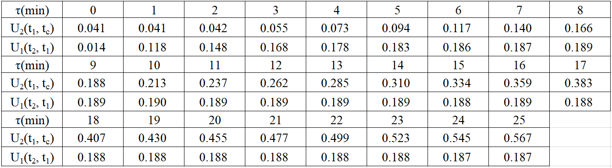
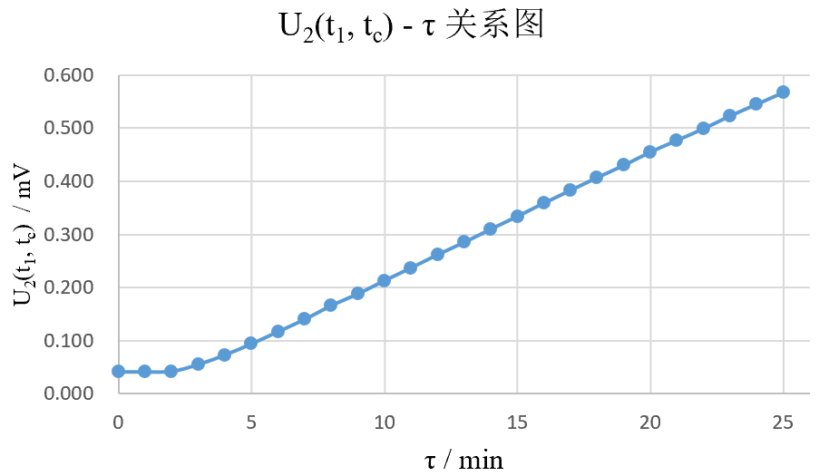
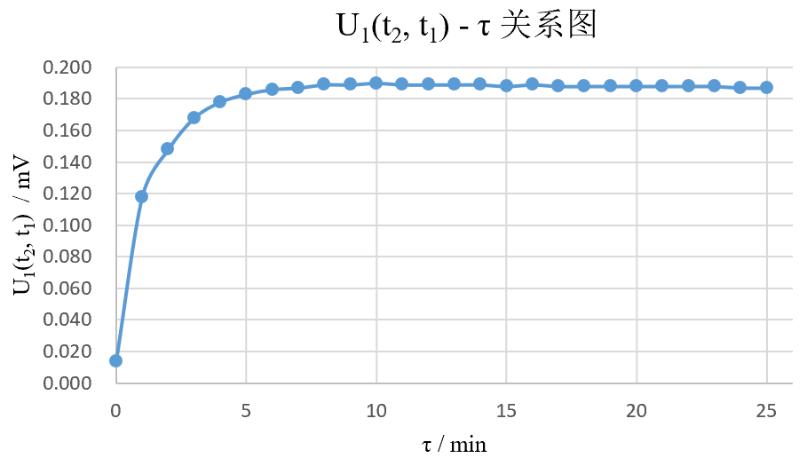
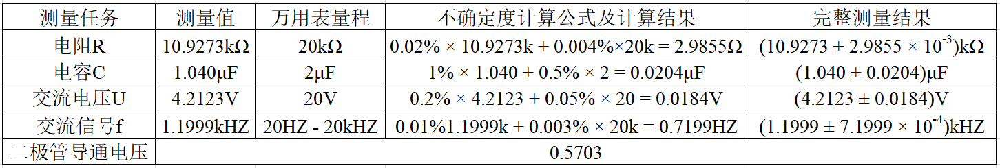

#
<big>准稳态法测不良导体的导热系数和比热 实验报告

###
 实验者姓名： 李昭阳&emsp;学号：2021013445&emsp;实验日期：2022/10/27&emsp;实验台号： 15

##实验目的
&ensp;&ensp;&ensp;
1、理解准稳态法测量不良导体的导热系数和比热原理，并通过快速测量学习掌握该方法；
 
&ensp;&ensp;&ensp;
2、掌握使用热电偶测量温度的方法；
 
&ensp;&ensp;&ensp;
3、学习使用数字万用表。
##实验仪器
&ensp;&ensp;&ensp;
(1) \\(90mm \times 90mm \times 10mm\\) 的有机玻璃样品
 
&ensp;&ensp;&ensp;
(2)薄膜加热器
 
&ensp;&ensp;&ensp;
(3)铜-康铜热电偶
 
&ensp;&ensp;&ensp;
(4)泡沫绝热体
 
&ensp;&ensp;&ensp;
(5)函数信号发生器
 
&ensp;&ensp;&ensp;
(6)数字万用表
 
&ensp;&ensp;&ensp;
(7)直流稳压电源
 
&ensp;&ensp;&ensp;
(8)保温杯（恒温冷端）
 
&ensp;&ensp;&ensp;
(9)双向闸刀开关
 
&ensp;&ensp;&ensp;
(10)电容、电阻、二极管
 
&ensp;&ensp;&ensp;
(11)秒表
##数据处理及结果

###准稳态法测不良导体的导热系数和比热

####实验前准备：
&ensp;&ensp;&ensp;
中心面热电偶阻值 = 4.406 Ω
 
&ensp;&ensp;&ensp;
加热面热电偶阻值 = 3.121 Ω
 
&ensp;&ensp;&ensp;
中心面冷端热电偶阻值 = 3.443 Ω
 
&ensp;&ensp;&ensp;
加热面冷端热电偶阻值 = 3.571 Ω
 
&ensp;&ensp;&ensp;
两个相同电加热薄膜并联后的阻值 = 55.159 Ω
 
&ensp;&ensp;&ensp;
冷端水温 = 22.2 ℃
 
&ensp;&ensp;&ensp;
直流电源加热电压： \\(U_前 = 18.0020 V\\)
 
####实验记录数据：

####数据处理：
&ensp;&ensp;&ensp;
作出 \\(U_1(t_2, t_1) − \tau\\) 曲线和 \\(U_2(t_1, t_c) − \tau\\) 曲线

 
&ensp;&ensp;&ensp;
从图中可知，当\\(9 min < \tau < 23 min\\)时，\\(U_1(t_2, t_1)\\)的变化幅度较小，可认为系统达到准稳态，对此后的点进行拟合，得

&ensp;&ensp;&ensp;
在准稳态下，计算加热面与中心面的温差，得
$$\Delta t = \frac{U_1(t_2, t_1)}{k} = \frac{188 - 14 \mu V}{40 \mu V/℃} = 4.35 K$$
&ensp;&ensp;&ensp;
其拟合方程为
$$U_2(t_1, t_c) = 0.024\tau - 0.026$$
&ensp;&ensp;&ensp;
\\(R^2 = 0.9998\\)，则可认为
$$\frac{\mathrm{d}U}{\mathrm{d}\tau} = 0.024&ensp;mV/min$$
&ensp;&ensp;&ensp;
故可知升温速率为
$$\frac{\mathrm{d}t}{\mathrm{d}\tau} = \frac{\mathrm{d}U}{\mathrm{d}\tau} \div k = 24 \div 40 \div 60 = 1 \times 10^{-2}&ensp;K/s$$
&ensp;&ensp;&ensp;
由于玻璃长宽均为\\(0.09m\\)，加热器电阻 \\(R = 2 \times 55.159 = 110.318\Omega\\)，加热电压\\(U = 18.0020 V\\)，则热流密度为
$$q_c = \frac{U^2}{2FR} = \frac{18.0020^2}{2 \times 0.09 \times 0.09 \times 110.318} = 181.334&ensp;W/m^2$$
&ensp;&ensp;&ensp;
厚度\\(L = 0.01m\\)，则导热系数为
$$\lambda = \frac{q_cL}{2\Delta t} = \frac{181.334 \times 0.01}{2 \times 4.35} = 0.208&ensp;W/(m \cdot K)$$
&ensp;&ensp;&ensp;
密度\\(\rho = 1196kg/m^3\\)，则比热为
$$c = \frac{q_c}{\rho L\frac{\mathrm{d}t}{\mathrm{d}\tau}} = \frac{181.334}{1196\times 0.01\times 1\times 10^{-2}} = 1516.17&ensp;J/(kg \cdot K)$$
####修正：
&ensp;&ensp;&ensp;
考虑薄膜加热器的热容、边缘绝热条件没满足等，热流密度按电功率的85%来修正，重新计算热流密度、导热系数与比热：
$$\dot q_c = q_c \times 85% = 154.133&ensp;W/m^2$$
$$\dot \lambda = \frac{q_c \times 85% \times L}{2\Delta t} = 0.177&ensp;W/(m \cdot K)$$
$$\dot c = \frac{q_c \times 85%}{\rho L\frac{\mathrm{d}t}{\mathrm{d}\tau}} = \frac{181.334}{1196\times 0.01\times 1\times 10^{-2}} = 1288.75&ensp;J/(kg \cdot K)$$

###数字万用表的使用

&ensp;&ensp;&ensp;
数据表格如下

##反思

###准稳态能否无限保持？实验时间是否是越长越好？

&ensp;&ensp;&ensp;
准稳态不能无限保持。当样品持续升温时，对外散热的速率会增大，由于散热导致的误差会增大。这会使得温差越来越小，故准稳态无法无限保持下去，所以并不是实验时间越长实验数据越好。
##原始数据记录

