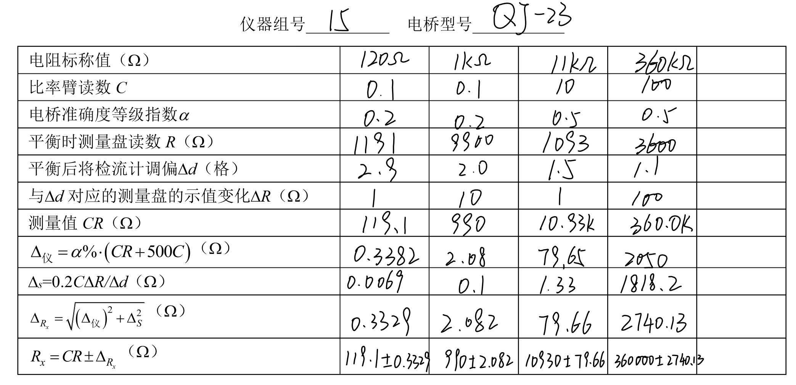
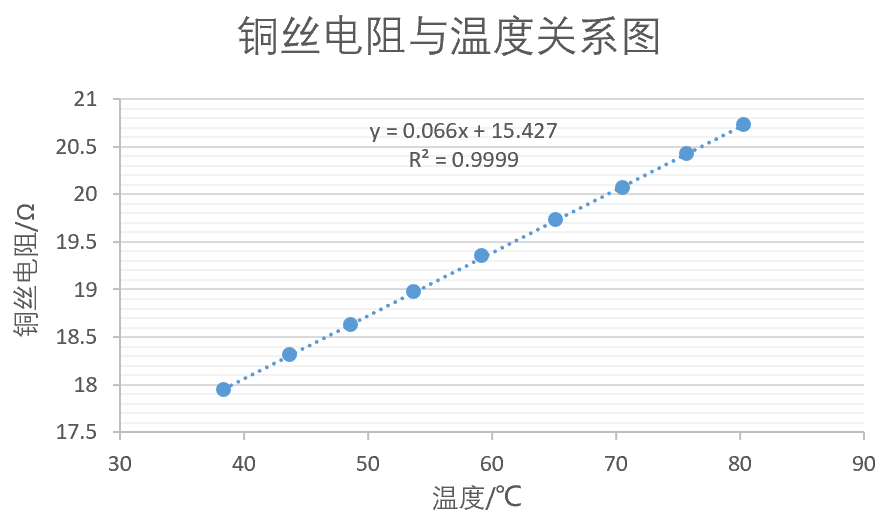
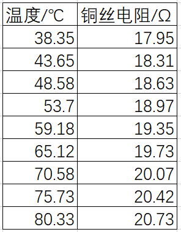
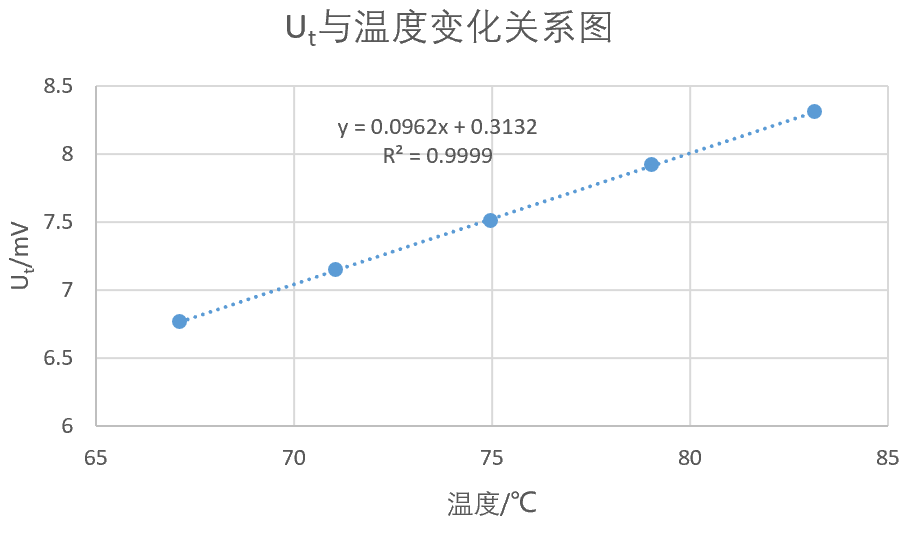
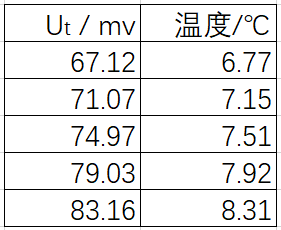
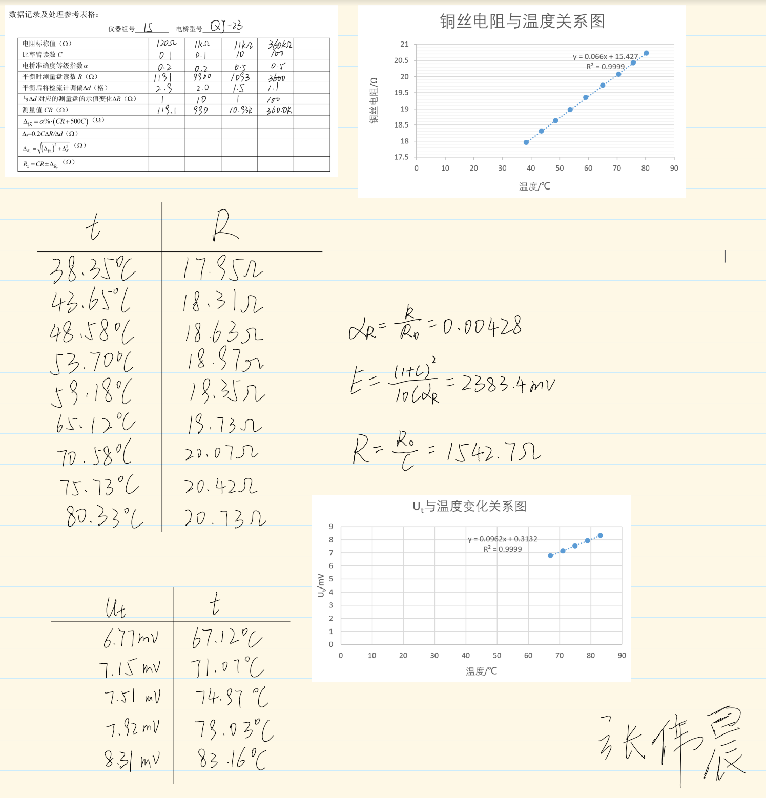

#
<big>直流电桥测电阻实验报告

###
 实验者姓名： 李昭阳&emsp;学号：2021013445&emsp;实验日期：2022/10/13&emsp;实验台号： 15

##实验目的
&ensp;&ensp;&ensp;
1、了解单电桥测电阻的原理，掌握单电桥测电阻的方法
 
&ensp;&ensp;&ensp;
2、利用单电桥测量铜丝温度电阻系数，学习作图和直线拟合的方法
 
&ensp;&ensp;&ensp;
3、用电桥组装数字温度计，学习桥路的应用分析设计
##实验仪器
&ensp;&ensp;&ensp;
QJ-23型携带式单电桥、直流稳压电源DC 5V、磁力搅拌器、电子温度计、数字调压器、万用表
##数据处理及结果

###惠斯通电桥测电阻

###单电桥测铜丝的电阻温度系数

&ensp;&ensp;&ensp;
由图中数据可得，\\(R_0 = 15.427 &ensp;\Omega\\)，代入计算参数可得，
$$\alpha_R  = \frac{R_t - R_0}{R_0t} = \frac{k}{R_0} = \frac{0.066}{15.427} = 0.00428 &ensp;\Omega$$
&ensp;&ensp;&ensp;
同时由图像可以分析得，金属电阻随着温度递增而线性递增。

###铜电阻数字温度计的设计组装及校验

&ensp;&ensp;&ensp;
对于电路设置参数，取定C = 0.01，有
$$E  = \frac{(1 + C)^2}{10C\alpha_R} = \frac{(1 + 0.01)^2}{10 \times 0.01 \times 0.00428} = 2383.4 &ensp;mV$$
$$R  = \frac{R_0}{C} = \frac{15.427}{0.01} = 1542.7 &ensp;\Omega$$
$$\Delta U  = -E\frac{(C\alpha_Rt)^2}{(1 + C)^3} = -2383.4 \times \frac{(0.01 \times 0.00428t)^2}{(1 + 0.01)^3} = -2313.9 \times (4.28 \times 10^{-5}t)^2 &ensp;mV$$
&ensp;&ensp;&ensp;
拟合出变化曲线如下，

&ensp;&ensp;&ensp;
则曲线可以近似认为Ut与t是线性关系，其关系式为
$$U_t  = 0.0962t + 0.3132 &ensp;(mV)$$
&ensp;&ensp;&ensp;
由于\\(t ≤ 100℃\\)，故在误差允许的范围内可以认为拟合曲线近似为 \\(U_t = \frac{1}{10}t + \Delta U\\) ，即认为组装的温度计满足设计要求。
##思考题

###为什么用单电桥测电阻一般比伏安法测量的准确度高？单电桥中检流计的准确度对实验中所用的平衡电桥法测量有无影响？

&ensp;&ensp;&ensp;
伏安法在电压的变化中有电源的内阻作用，造成了检测的误差。单电桥测电阻则是以桥路的平衡来检测，虽然也含有内阻的电源，但电桥消除了电源内阻对检测回路的影响。
 
&ensp;&ensp;&ensp;
检流计的准确度对测量有影响。因为当电桥不够“灵敏”时，\\(\Delta S\\)会增加，引起\\(\Delta R_x = \sqrt{(\Delta_仪)^2 + \Delta S^2}\\) 增加，即使得测量结果的不确定度增加。

###用惠斯通电桥测量电阻时，如果发现检流计的指针总是向一边偏转，请分析可能的原因。

&ensp;&ensp;&ensp;
1、在实验开始前未进行机械调零或电源、检流计接错或出现故障；
 
&ensp;&ensp;&ensp;
2、电桥C值过大或过小，导致在四位有效数字内均无法检出匹配的\\(R_x\\)；
 
&ensp;&ensp;&ensp;
3、被测电阻\\(R_x\\)过大或过小，超出电桥法测电阻的量程。
##原始数据记录

