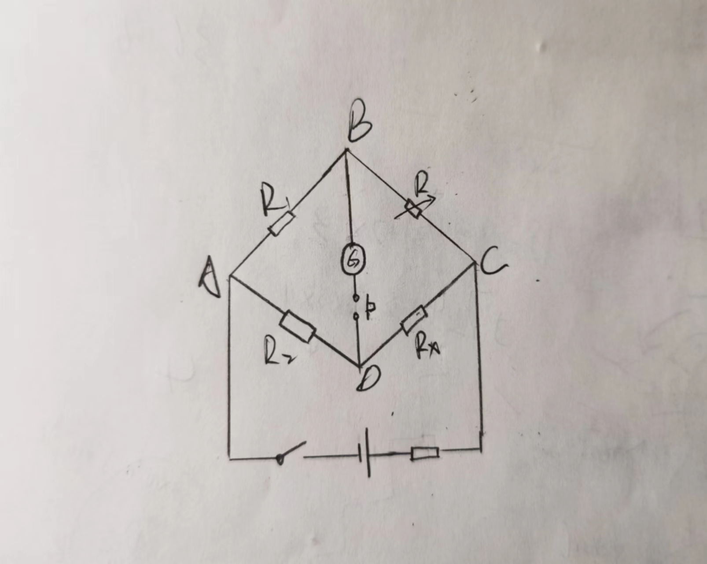

#
<big>直流电桥测电阻预习报告

###**
 李昭阳 2021013445**

##请列举出你所了解的测量电阻的方法
&ensp;&ensp;&ensp;
伏安法、谐振法、欧姆表法、直流电桥法。
##画出直流单电桥测量电阻的电路原理图，并简述其构成及测量原理，思考为什么电桥法测量电阻的测量精度会比较高？
###电路原理图

###构成及测量原理
&ensp;&ensp;&ensp;
直流电桥主要由两个定值电阻R1和R2、一个可变电阻R、一个检流计G、一个待测电阻Rx、一个开关、一个保护电阻和一个电源构成。
 
&ensp;&ensp;&ensp;
当电桥达到平衡，即G电流计中无电流通过时，有
$$\frac{R_x}{R_2} = \frac{R}{R_1}$$
&ensp;&ensp;&ensp;
即，
$$R_x = \frac{R_2}{R_1}R$$
###电桥法测量电阻的测量精度会比较高的原因
&ensp;&ensp;&ensp;
只要检流计足够灵敏，Rx的计算式就可以成立，所以其测量结果可以达到已知标准电阻所具有的准确度，且与电源电压无关。这一过程相当于把Rx和标准电阻做比较，因而测量的准确度较高。
##查阅资料，了解并简述不同种类的材料的电阻率随温度变化的规律
&ensp;&ensp;&ensp;
金属的电阻率随温度的升高而增大，但有些合金如锰铜和康铜合金，电阻率几乎不受温度变化的影响，碳和一些绝缘体的电阻随温度的升高而减小。
##在组装数字温度计时，电路采用互易桥而不直接采用非平衡桥，这样做有什么优点？
&ensp;&ensp;&ensp;
桥臂之间的关系更为合理（R1、R2分别和R、Rt同数量级），用它测量 Ut 非线性误差会减小。
