

#
<big>几何光学基础仿真实验 实验报告

###
 实验者姓名： 李昭阳&emsp;学号：2021013445&emsp;实验日期：2022/12/06&emsp;实验台号：线上

##实验目的
&ensp;&ensp;&ensp;
1、认识简单光路并学习绘制、分析光路
 
&ensp;&ensp;&ensp;
2、了解影响透镜焦距的因素
 
&ensp;&ensp;&ensp;
3、学习透镜成像规律并掌握透镜焦距的基本测量方法
##实验工具
&ensp;&ensp;&ensp;
(1) 科罗拉多大学波德分校创建的数学和科学互动程序（PhET）中的“几何光学（geometric-optics）”程序
##数据处理及结果

###研究透镜焦距决定因素

####研究透镜焦距f与其曲率半径n的关系

透镜焦距f与其曲率半径n关系记录表
 
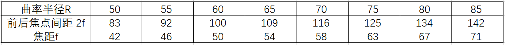
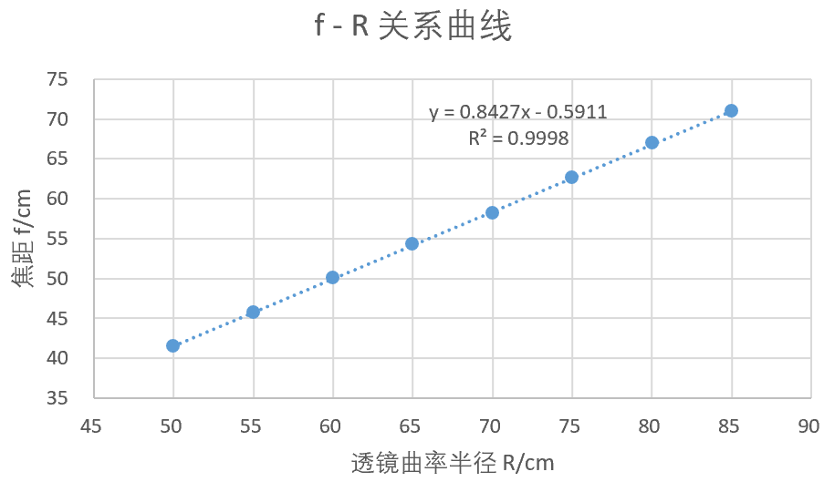
 
透镜焦距f与其曲率半径n关系记录图
 

 
&ensp;&ensp;&ensp;
由拟合曲线可见，焦距和曲率半径成正相关。
####研究透镜焦距f与其制作材料的折射率n之间的关系

透镜焦距f与其制作材料的折射率n关系记录表
 
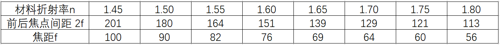
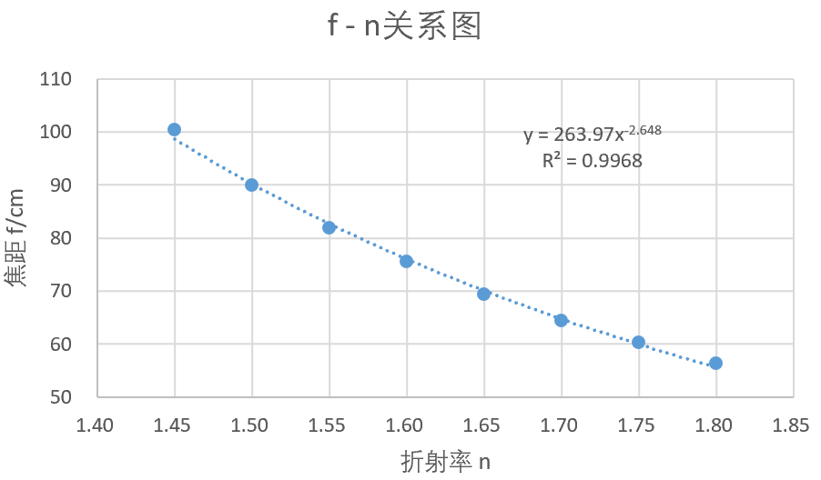
 
透镜焦距f与其制作材料的折射率n关系记录图
 

 
&ensp;&ensp;&ensp;
由拟合曲线可见，焦距和制作材料折射率成反相关关系。

###透镜成像及其焦距测量

####凸透镜成像的规律特点
&ensp;&ensp;&ensp;
记物距为p，像距为q，焦距为f。

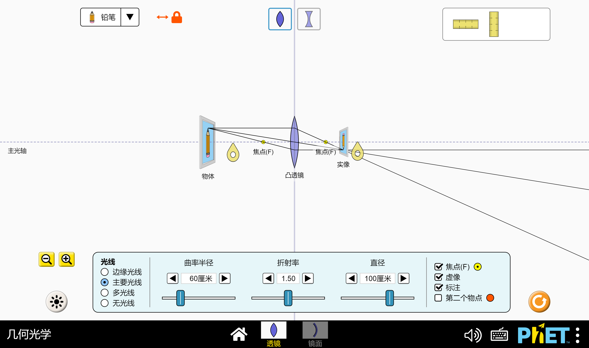
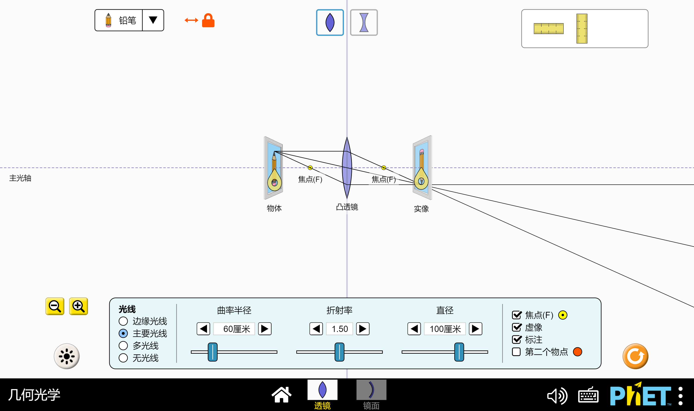
 
\\(p > 2f\\)&ensp;&ensp;&ensp;&ensp;&ensp;&ensp;&ensp;&ensp;&ensp;&ensp;&ensp;&ensp;&ensp;&ensp;&ensp;&ensp;&ensp;&ensp;&ensp;&ensp;&ensp;&ensp;&ensp;&ensp;&ensp;&ensp;&ensp;&ensp;&ensp;&ensp;&ensp;&ensp;\\(p = 2f\\)
 
 
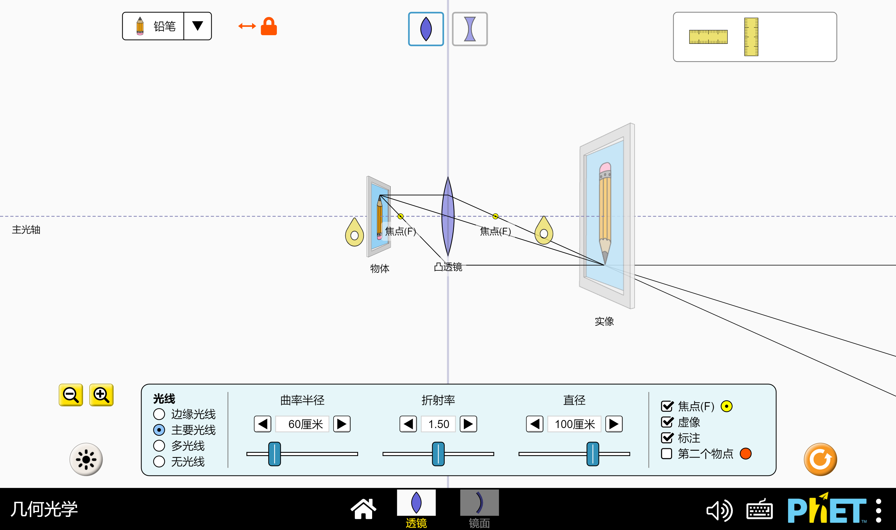
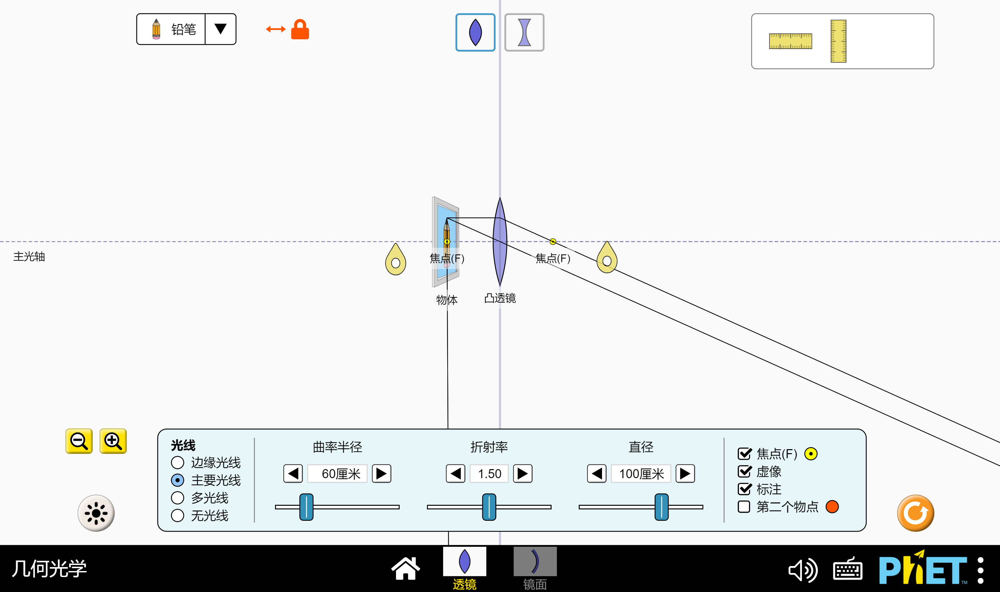
 
\\(f < p < 2f\\)&ensp;&ensp;&ensp;&ensp;&ensp;&ensp;&ensp;&ensp;&ensp;&ensp;&ensp;&ensp;&ensp;&ensp;&ensp;&ensp;&ensp;&ensp;&ensp;&ensp;&ensp;&ensp;&ensp;&ensp;&ensp;&ensp;&ensp;&ensp;&ensp;&ensp;&ensp;&ensp;\\(p = f\\)
 
 
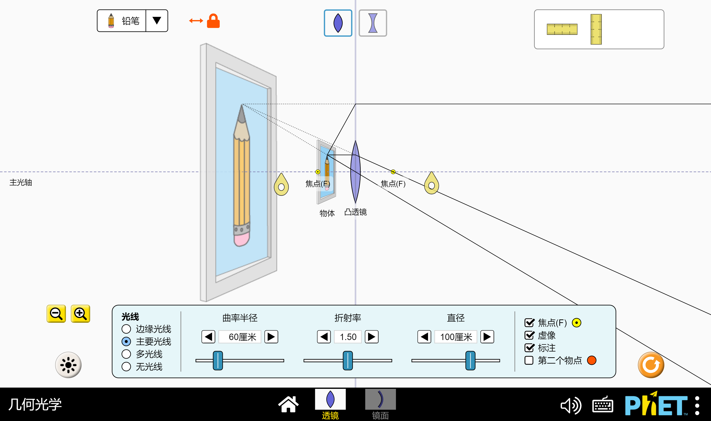
 
\\(p < f\\)

&ensp;&ensp;&ensp;
总结得，当 \\(p > 2f\\) 时，成倒立缩小的实像；当 \\(p = 2f\\) 时，成倒立等大的实像；当 \\(f < p < 2f\\) 时，成倒立放大的实像；当 \\(p = f\\) 时，不成像；当 \\(p = f\\) 时，成正立放大的虚像。
####凹透镜成像的规律特点
&ensp;&ensp;&ensp;
记物距为p，像距为q，焦距为f。

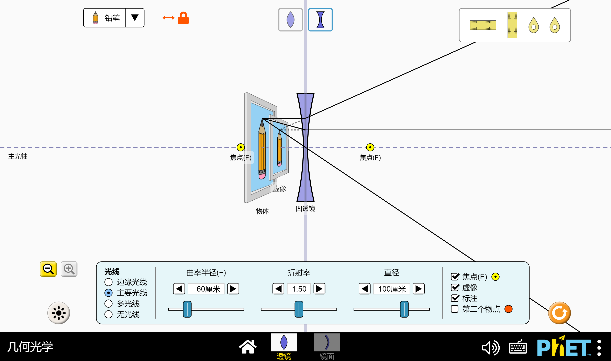
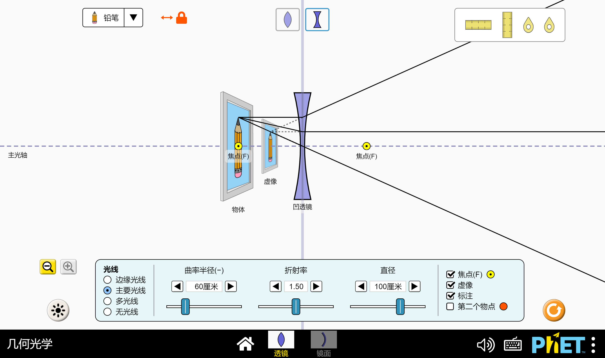
 
\\(p < f\\)&ensp;&ensp;&ensp;&ensp;&ensp;&ensp;&ensp;&ensp;&ensp;&ensp;&ensp;&ensp;&ensp;&ensp;&ensp;&ensp;&ensp;&ensp;&ensp;&ensp;&ensp;&ensp;&ensp;&ensp;&ensp;&ensp;&ensp;&ensp;&ensp;&ensp;&ensp;&ensp;\\(p = f\\)
 
 
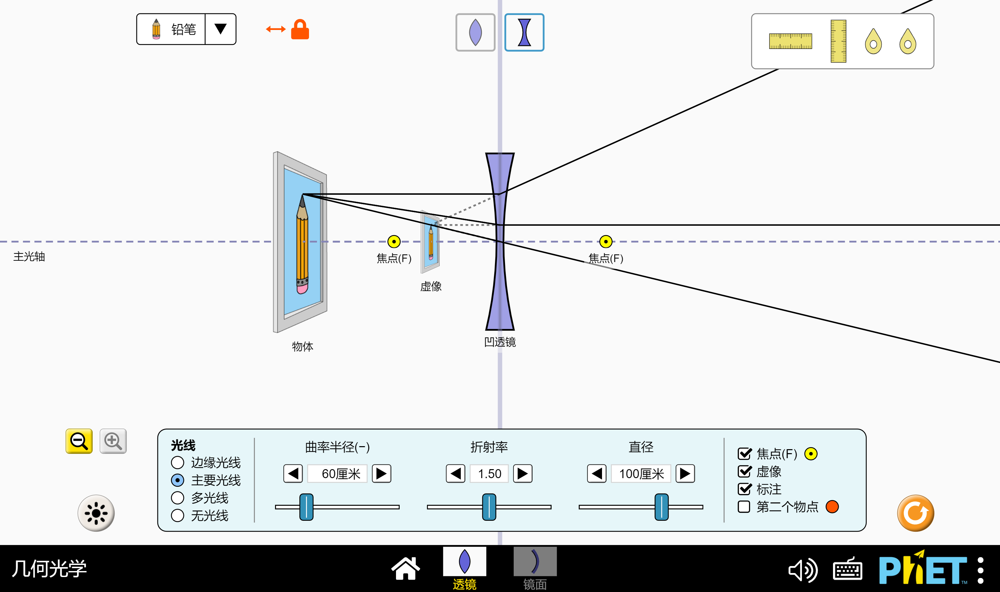
 
\\(p > f\\)

&ensp;&ensp;&ensp;
总结得，凹透镜始终成倒立缩小的虚像。

####凸透镜焦距的计算
&ensp;&ensp;&ensp;
由透镜前后焦点间距求得 \\(f_1 = \frac{2f}{2} = 75.5 cm\\)，与理论值 \\(f = \frac{R}{2(n - 1)} = \frac{90}{2 \times (1.6 - 1)} = \\) \\(75.0 cm\\) 的相对偏差为 \\(0.5 cm\\) 。
 
&ensp;&ensp;&ensp;
移动箭头位于 \\(p = 2f\\) 位置处，测得箭头高度 \\(y = 60 cm\\)，像的高度 \\(y' = -58 cm\\)，计算线放大率得，
$$\beta = \frac{y'}{y} = \frac{58}{60} = 0.967 \approx 1 = -\frac{2f}{2f} = -\frac{q}{p}$$
&ensp;&ensp;&ensp;
可认为测量结果与理论预期结果一致。
 
&ensp;&ensp;&ensp;
用物距像距法求焦距，先测量曲率半径 \\(R = 90 cm\\)、透镜折射率 \\(n = 1.60\\) 条件下，凸透镜成像时的物距和像距。再根据 \\(\frac{1}{f} = \frac{1}{p} + \frac{1}{q}\\) 计算出焦距，得到如下表格。

凸透镜物距、像距距测量记录表
 
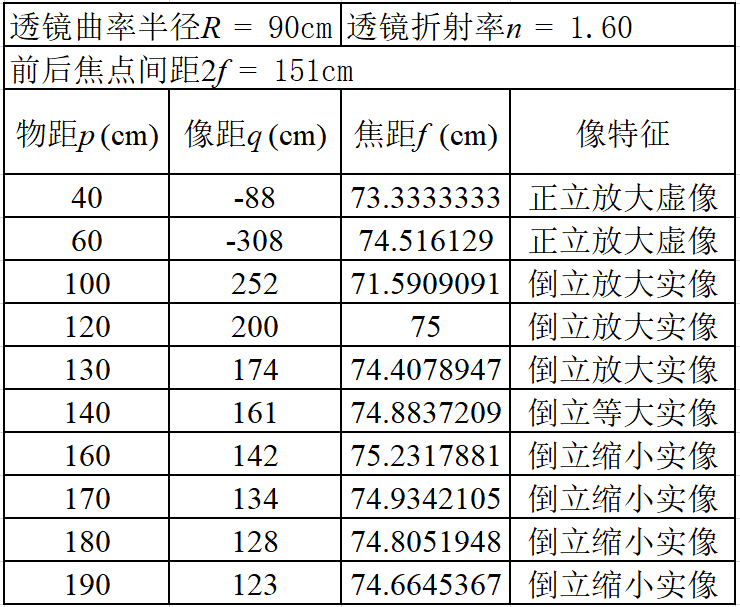

&ensp;&ensp;&ensp;
求平均值 \\(\bar{f} = 74.337 cm\\)，计算不确定度得，
$$\Delta_f = \frac{t_{0.95}(v)}{\sqrt{n}}S_f = \frac{2.23}{\sqrt{10}} \times 1.096 = 0.773 cm$$
&ensp;&ensp;&ensp;
则当前透镜参数下凸透镜的焦距为，
$$f = \bar{f} \pm \Delta_f = 74.337 \pm 0.773 cm$$
&ensp;&ensp;&ensp;
与理论值 \\(f = 75.0 cm\\) 的相对偏差为 \\(0.663 \pm 0.773 cm\\) 。
 
&ensp;&ensp;&ensp;
移动箭头位于 \\(p = 2f\\) 位置处，测得箭头高度 \\(y = 60 cm\\)，像的高度 \\(y' = -59 cm\\)，计算线放大率得，
$$\beta = \frac{y'}{y} = \frac{59}{60} = 0.983 \approx 1 = -\frac{2f}{2f} = -\frac{q}{p}$$
&ensp;&ensp;&ensp;
可认为测量结果与理论预期结果一致。
####凹透镜焦距的计算
&ensp;&ensp;&ensp;
由透镜前后焦点间距求得 \\(f = -\frac{2f}{2} = -75.5 cm\\)，与理论值 \\(f = -\frac{R}{2(n - 1)} = \\)\\(-\frac{90}{2 \times (1.6 - 1)}\\) \\(= -75.0 cm\\)的相对偏差为 \\(0.5 cm\\)。
 
&ensp;&ensp;&ensp;
用物距像距法求焦距，先测量曲率半径 \\(R = 90 cm\\)、透镜折射率 \\(n = 1.60\\) 条件下，凹透镜成像时的物距和像距。再根据 \\(\frac{1}{f} = \frac{1}{p} + \frac{1}{q}\\) 计算出焦距，得到如下表格，

凹透镜物距、像距距测量记录表
 
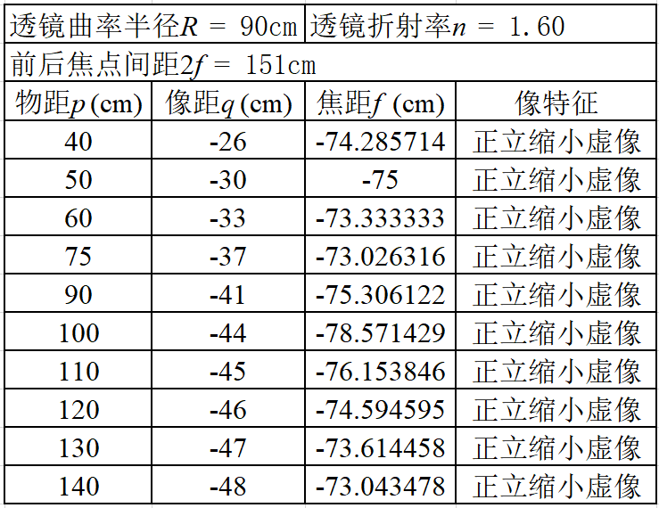

 
&ensp;&ensp;&ensp;
求平均值 \\(\bar{f} = -74.693 cm\\)，计算不确定度得，
$$\Delta_f = \frac{t_{0.95}(v)}{\sqrt{n}}S_f = \frac{2.23}{\sqrt{10}} \times 1.711 = 1.207 cm$$
&ensp;&ensp;&ensp;
则当前透镜参数下凹透镜的焦距为，
$$f = \bar{f} \pm \Delta_f = -74.693 \pm 1.207 cm$$
&ensp;&ensp;&ensp;
与理论值 \\(f = -75.0 cm\\) 的相对偏差为 \\(0.307 \pm 1.207 cm\\)。
