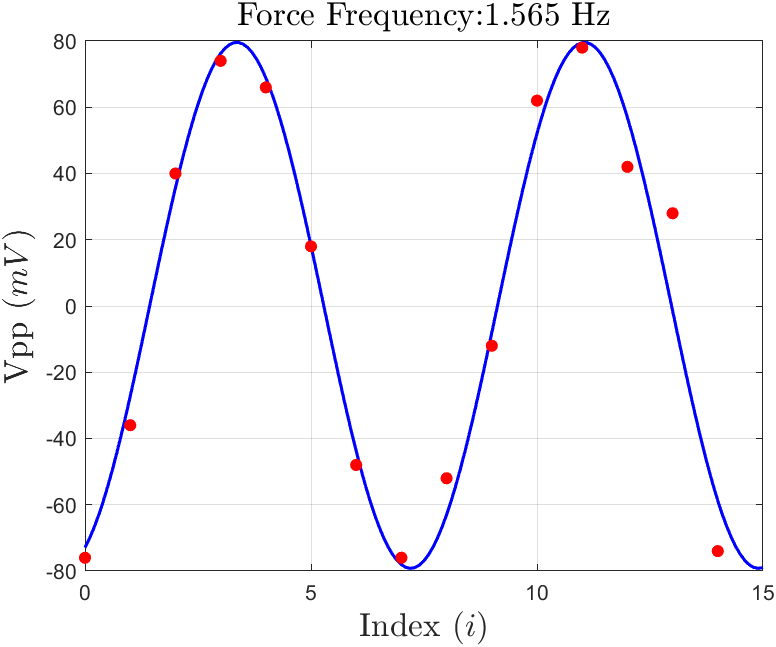

#
<big>耦合摆 实验报告

###
 实验者姓名： 李昭阳&emsp;学号：2021013445&emsp;实验日期：2022/11/24&emsp;实验台号： 15

##实验目的
&ensp;&ensp;&ensp;
1、通过对耦合系统的振动及波动现象的观测及其特性的测量，熟悉和加深对振动与波动学基本概念和原理的直观理解与掌握，提高利用物理学原理对实验现象的分析能力
 
&ensp;&ensp;&ensp;
2、学习信号源、示波器等常用实验仪器的基本使用
 
&ensp;&ensp;&ensp;
3、学习利用科学计算工具软件（如Matlab）处理实验数据
##实验仪器
&ensp;&ensp;&ensp;
(1) 信号源（函数信号发生器）
 
&ensp;&ensp;&ensp;
(2) 数字示波器
 
&ensp;&ensp;&ensp;
(3) 耦合摆控制仪
##实验原理

###信号观测

&ensp;&ensp;&ensp;
连接信号源和示波器，设置信号源输出一频率为 60Hz、峰峰值为 2.5V 的正弦信号，在示波器上进行观测。调节示波器呈现适合观测的波形，利用光标手动测量波形的有关参数。

###耦合链的自由振动及其固有频率测量

&ensp;&ensp;&ensp;
假设耦合摆链由 N 个相同单摆构成，则该一维波动系统具有 N 个本征振动模式，每一种本征模式对应着一个固有频率。耦合链的任何自由振动都是这 N 个固有振动模式的线性叠加。
 
&ensp;&ensp;&ensp;
利用示波器的 FFT 功能，对单摆随时间变化的振动曲线进行分析，每一个谱峰对应耦合链的一个固有频率。

###耦合链的色散关系测量

&ensp;&ensp;&ensp;
波长 \\(\lambda\\) 与频率 \\(f\\) 之间存在以下关系，
$$f = \sqrt{f_p^2 + 4f_s^2sin^2(\frac{ka}{2})}$$
&ensp;&ensp;&ensp;
此为耦合系统的色散关系。
 
&ensp;&ensp;&ensp;
当耦合链的两端自由不受任何约束时，波长只能取\\(k = \frac{q\pi}{Na}，每一个q对应一个k，并且对应一个固有频率f，即系统有N个振动模式。
##实验内容

###信号观测

&ensp;&ensp;&ensp;
观测示波器的波形，比较测量结果和信号源设置值间的差异。

###耦合链的自由振动及其固有频率测量

&ensp;&ensp;&ensp;
调节示波器的水平扫描时间设置为 2s
 
&ensp;&ensp;&ensp;
敲击耦合摆右端，使耦合链随机振荡，调节示波器展示波形
 
&ensp;&ensp;&ensp;
开启FFT模式，观察傅里叶分解后的波形，每一个波峰代表一个固有频率，调节示波器游标记录该频率

###耦合链的色散关系测量

&ensp;&ensp;&ensp;
设置信号源输出波形为正弦波，幅度峰-峰值为 300mVpp，设置信号源频率在某一固有频率附近，调节励磁电流，使系统产生较大幅度的振动。
 
&ensp;&ensp;&ensp;
等待系统达到稳定振动状态后，沿导轨移动位置探测器，依次测量每个单摆的相对振幅及其符号。
##数据处理及结果

###信号观测

波形的参数记录
 

&ensp;&ensp;&ensp;
测量结果和信号源设置值之间的差异：显示结果与设定参数的值有较微小的差异，产生差异的原因可能是噪声信号的干扰和测量时调节光标的偶然误差。 

###耦合链的自由振动及其固有频率测量

固有频率数据记录表格
 

 
&ensp;&ensp;&ensp;
该耦合链的任何自由振动都是15个固有振动模式的线性叠加，故应该移动位置探测器观测其它单摆的振动，对其它单摆振动结果也做傅里叶变换，验证之前的测量结果，并对误差较大之处进行修正。

###耦合链的色散关系测量

####估算耦合链的通频带范围
&ensp;&ensp;&ensp;
根据单摆简谐运动在耦合链中波的波长 \\(\lambda\\) 和频率 \\(f\\)存在关系\\(f = \sqrt{f_p^2 + 4f_s^2sin^2(\frac{ka}{2})}\\)，其中 \\(k = \frac{2\pi}{\lambda}\\) 为波数，\\(f_p = \frac{1}{2\pi}\sqrt{\frac{g}{L}}\\)，\\(f_s = \frac{1}{2\pi}\sqrt{\frac{k}{M}}\\)。带入数据计算，可得\\(f_p = 0.7045 Hz\\)，\\(f_s = 1.7757 Hz\\)，则\\(f_m = 0.7045 Hz\\)，\\(f_{max} = 3.6206 Hz\\)。
####测量耦合链的色散曲线

数据记录表格
 

&ensp;&ensp;&ensp;
当 \\(f = 0.845 Hz\\) 时，Matlab拟合得到，

&ensp;&ensp;&ensp;
由Matlab拟合得\\(k = 0.0780\\)。
 
&ensp;&ensp;&ensp;
当 \\(f = 1.030 Hz\\) 时，Matlab拟合得到，

&ensp;&ensp;&ensp;
由Matlab拟合得\\(k = 0.1439\\)。
 
&ensp;&ensp;&ensp;
当 \\(f = 1.290 Hz\\) 时，Matlab拟合得到，

&ensp;&ensp;&ensp;
由Matlab拟合得\\(k = 0.2183\\)。
 
&ensp;&ensp;&ensp;
当 \\(f = 1.565 Hz\\) 时，Matlab拟合得到，

&ensp;&ensp;&ensp;
由Matlab拟合得\\(k = 0.2599\\)。
 
&ensp;&ensp;&ensp;
当 \\(f = 1.865 Hz\\) 时，Matlab拟合得到，

&ensp;&ensp;&ensp;
由Matlab拟合得\\(k = 0.3599\\)。
 
&ensp;&ensp;&ensp;
当 \\(f = 2.170 Hz\\) 时，Matlab拟合得到，

&ensp;&ensp;&ensp;
由Matlab拟合得\\(k = 0.4321\\)。
 
&ensp;&ensp;&ensp;
根据公式\\(f = \sqrt{f_p^2 + 4f_s^2sin^2(\frac{ka}{2})}\\)得如下拟合曲线

&ensp;&ensp;&ensp;
命令行输出得\\(f_p = 0.7448 Hz\\)，\\(f_s = 1.6248 Hz\\)。
####分析估计测量耦合链固有频率结果的主要误差来源
&ensp;&ensp;&ensp;
由测量结果知 \\(f_p\\) 的误差较小，\\(f_s\\) 误差较大。我认为误差主要来源于空气阻力对被测摆球与其它摆球以及上部连接处的摩擦，对运动情况会有影响，即在测量固有频率时敲击最右端的单摆摆锤较长时间后，摆锤振幅会逐渐减小。
###通频带外的振动在耦合链中的传播
&ensp;&ensp;&ensp;
若激励频率略低于通频带下限，发现单摆的振幅由0-14逐个递减，且所有摆球振动方向一致；
 
&ensp;&ensp;&ensp;
若激励频率略高于通频带上限，发现只有靠近0号的几个摆球振幅较强，7号之后的单摆明显不动。
##实验小结
&ensp;&ensp;&ensp;
在本次实验中，我熟悉和加深了对振动与波动学基本概念和原理，对许多抽象化的概念有了具象化的认识。
 
&ensp;&ensp;&ensp;
但在耦合链的色散关系测量的过程中，我的示波器初始值未能设置好，导致出现跳动的正弦曲线。后来经过调整时间分度值，成功解决了这个问题，测量也较为准确。
 
&ensp;&ensp;&ensp;
最后，感谢李老师在实验过程中对我的指导。您的帮助使我的实验更加准确和高效。
##原始数据记录

