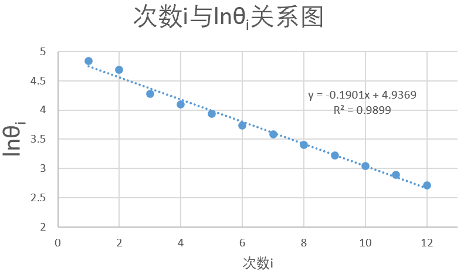
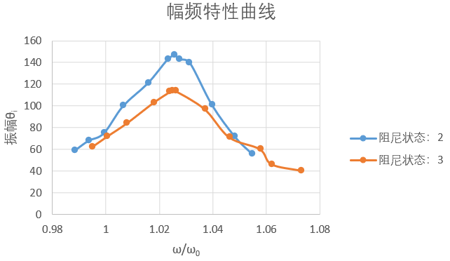

#
<big>阻尼振动和受迫振动 实验报告

###
 实验者姓名： 李昭阳&emsp;学号：2021013445&emsp;实验日期：2022/11/10&emsp;实验台号： 15

##实验目的
&ensp;&ensp;&ensp;
1、观测阻尼振动，学习测量振动系统基本参数的方法
 
&ensp;&ensp;&ensp;
2、研究受迫振动的幅频特性和相频特性，观察共振现象
 
&ensp;&ensp;&ensp;
3、观测不同阻尼对受迫振动的影响
##实验仪器
&ensp;&ensp;&ensp;
(1) 波耳共振仪

 
&ensp;&ensp;&ensp;
(2)闪光灯
##数据处理及结果

###计算最小阻尼时的阻尼比 \\(\zeta\\) 、振动周期 \\(\overline{T_d}\\) 和固有角频率 \\(\omega_0\\)

####实验记录数据：

最小阻尼时数据记录表
 

 
振动周期\\(10T_d\\)数据表
 

 
####数据处理：

####计算最小阻尼时的阻尼比 \\(\zeta\\)

&ensp;&ensp;&ensp;
记因变量\\(y = \ln{\theta _i}\\)，自变量\\(x = i\\)，用最小二乘法拟合直线\\(y = a + bx\\)，得到以下图像，

&ensp;&ensp;&ensp;
计算可得\\(b = \frac{\sum (x_i - \bar{x})(y_i - \bar{y})}{\sum (x_i - \bar{x})^2} = -9.626 \times 10^{-3}\\)，\\(R^2 = 0.9978\\)，由公式\\(b = -\frac{2\pi}{\sqrt{\zeta^{-2} - 1}}\\)得，
$$\zeta = \sqrt{\frac{b^2}{4\pi^2 + b^2}} = \sqrt{\frac{(-9.626 \times 10^{-3})^2}{4\pi^2 + (-9.626 \times 10^{-3})^2}} = 1.532 \times 10^{-3}$$
&ensp;&ensp;&ensp;
再计算其不确定度，公式为，
$$\Delta _b = t(v)S_b = t(n-2)|b|\sqrt{\frac{r^{-2} - 1}{n - 2}} = 2.010 \times 9.626 \times 10^{-3} \times \sqrt{\frac{\frac{1}{0.9978} - 1}{48}} = 1.311 \times 10^{-4}$$
$$\Delta _\zeta = \frac{4\pi^2}{(4\pi^2 + b^2)^{\frac{3}{2}}}\Delta _b = 2.087 \times 10^{-5}$$
&ensp;&ensp;&ensp;
\\(\zeta\\)的最终计算结果为
$$\zeta = (1.532 \pm 0.021) \times 10^{-3}$$

####计算振动周期 \\(\overline{T_d}\\)

&ensp;&ensp;&ensp;
计算\\(\overline{T_d}\\)和\\(\Delta_T\\)得
$$\overline{T_d} = \frac{\sum T_i}{50} = 1.5432 s$$
$$\Delta_T = \frac{\overline{T_d}}{10^5} + \frac{0.001}{10} = 1.1543 \times 10^{-4}$$
&ensp;&ensp;&ensp;
\\(\overline{T_d}\\)最终计算结果为
$$\overline{T_d} = (1.5432 \pm 0.0001) rad/s$$

####计算固有角频率 \\(\omega_0\\)

&ensp;&ensp;&ensp;
计算\\(\omega _0\\)和\\(\Delta_w\\)得
$$\omega _0 = \frac{2\pi}{\overline{T_d}\sqrt{1 - \zeta^2}} = \frac{2\pi}{1.543\sqrt{1 - (1.532 \times 10^{-3})^2}} = 4.072 rad/s$$
$$\Delta_w = \omega _0\sqrt{(\frac{\Delta _T}{\overline{T_d}})^2 + (\frac{\zeta \cdot \Delta _{\zeta}}{1 - \zeta^2})^2} = 4.072\sqrt{(\frac{1.154 \times 10^{-4}}{1.543})^2 + (\frac{1.532 \times 10^{-3} \times 2.087 \times 10^{-5}}{1 - (1.532 \times 10^{-3})^2})^2} = 3.034 \times 10^{-4} rad/s$$
&ensp;&ensp;&ensp;
\\(\omega _0\\)最终计算结果为
$$\omega_0 = (4.0720 \pm 0.0003) rad/s$$

###计算其他三种阻尼状态下阻尼比 \\(\zeta\\) 和 时间常数 \\(\tau\\)

####实验记录数据：
&ensp;&ensp;&ensp;

阻尼状态2数据记录表
&ensp;&ensp;&ensp;&ensp;&ensp;&ensp;&ensp;&ensp;&ensp;&ensp;&ensp;&ensp;&ensp;&ensp;&ensp;&ensp;&ensp;&ensp;&ensp;&ensp;&ensp;&ensp;&ensp;&ensp;&ensp;&ensp;&ensp;
阻尼状态3数据记录表
 

 
####数据处理：

####计算阻尼状态2下的阻尼比 \\(\zeta\\)

&ensp;&ensp;&ensp;
记因变量\\(y = \ln{\theta _i}\\)，自变量\\(x = i\\)，用最小二乘法拟合直线\\(y = a + bx\\)，得到以下图像，

&ensp;&ensp;&ensp;
计算可得\\(b = \frac{\sum (x_i - \bar{x})(y_i - \bar{y})}{\sum (x_i - \bar{x})^2} = -0.124\\)，\\(R^2 = 0.9997\\)，由公式\\(b = -\frac{2\pi}{\sqrt{\zeta^{-2} - 1}}\\)得，
$$\zeta = \sqrt{\frac{b^2}{4\pi^2 + b^2}} = \sqrt{\frac{(-0.124)^2}{4\pi^2 + (-0.124)^2}} = 1.968 \times 10^{-2}$$
再计算其不确定度，公式为，
$$\Delta _b = t(v)S_b = t(n-2)|b|\sqrt{\frac{r^{-2} - 1}{n - 2}} = 2.010 \times 0.124 \times \sqrt{\frac{\frac{1}{0.9997} - 1}{48}} = 6.217 \times 10^{-4}$$
$$\Delta _\zeta = \frac{4\pi^2}{(4\pi^2 + b^2)^{\frac{3}{2}}}\Delta _b = 9.889 \times 10^{-5}$$
&ensp;&ensp;&ensp;
\\(\zeta\\)的最终计算结果为
$$\zeta = (1.968 \pm 0.009) \times 10^{-2}$$

####计算时间常数 \\(\tau\\)

&ensp;&ensp;&ensp;
计算\\(T_d\\)得
$$T_d = \frac{\sum T_i}{12} = 1.543 s$$
&ensp;&ensp;&ensp;
计算\\(\omega _0\\)得
$$\omega _0 = \frac{2\pi}{T_d\sqrt{1 - \zeta^2}} = \frac{2\pi}{1.543\sqrt{1 - (1.968 \times 10^{-2})^2}} = 4.073 rad/s$$
&ensp;&ensp;&ensp;
由\\(\ln{\theta _{i + 1}} - \ln{\theta _i} = -\beta T_d = -\beta\frac{2\pi}{\sqrt{\omega_0^2 - \beta^2}} = -\frac{2\pi}{\sqrt{\zeta^{-2} - 1}}\\)得
$$\tau = \frac{1}{\beta} = -\frac{T_d}{b} = \frac{1.543}{0.124} = 12.443 s$$

####计算阻尼状态3下的阻尼比 \\(\zeta\\)

&ensp;&ensp;&ensp;
记因变量\\(y = \ln{\theta _i}\\)，自变量\\(x = i\\)，用最小二乘法拟合直线\\(y = a + bx\\)，得到以下图像，

&ensp;&ensp;&ensp;
计算可得\\(b = \frac{\sum (x_i - \bar{x})(y_i - \bar{y})}{\sum (x_i - \bar{x})^2} = -0.190\\)，\\(R^2 = 0.9899\\)，由公式\\(b = -\frac{2\pi}{\sqrt{\zeta^{-2} - 1}}\\)得，
$$\zeta = \sqrt{\frac{b^2}{4\pi^2 + b^2}} = \sqrt{\frac{(-0.190)^2}{4\pi^2 + (-0.190)^2}} = 3.023 \times 10^{-2}$$
再计算其不确定度，公式为，
$$\Delta _b = t(v)S_b = t(n-2)|b|\sqrt{\frac{r^{-2} - 1}{n - 2}} = 2.010 \times 0.190 \times \sqrt{\frac{\frac{1}{0.9899} - 1}{48}} = 5.568 \times 10^{-3}$$
$$\Delta _\zeta = \frac{4\pi^2}{(4\pi^2 + b^2)^{\frac{3}{2}}}\Delta _b = 8.850 \times 10^{-4}$$
&ensp;&ensp;&ensp;
\\(\zeta\\)的最终计算结果为
$$\zeta = (3.023 \pm 0.089) \times 10^{-2}$$

####计算时间常数 \\(\tau\\)

&ensp;&ensp;&ensp;
计算\\(T_d\\)得
$$T_d = \frac{\sum T_i}{12} = 1.553 s$$
&ensp;&ensp;&ensp;
计算\\(\omega _0\\)得
$$\omega _0 = \frac{2\pi}{T_d\sqrt{1 - \zeta^2}} = \frac{2\pi}{1.553\sqrt{1 - (3.023 \times 10^{-2})^2}} = 4.047 rad/s$$
&ensp;&ensp;&ensp;
由\\(\ln{\theta _{i + 1}} - \ln{\theta _i} = -\beta T_d = -\beta\frac{2\pi}{\sqrt{\omega_0^2 - \beta^2}} = -\frac{2\pi}{\sqrt{\zeta^{-2} - 1}}\\)得
$$\tau = \frac{1}{\beta} = -\frac{T_d}{b} = \frac{1.553}{0.190} = 8.174 s$$

###不同阻尼状态下时间常数\\(\tau\\)的比较

&ensp;&ensp;&ensp;
时间常数是阻尼振动的振幅衰减到原来的\\(\frac{1}{e}\\)所需要的时间。由于阻尼状态2档的阻尼低于阻尼状态3档的阻尼，振动能量衰减相对慢，故时间常数阻尼状态2档高于阻尼状态3档，计算结果与实验预期相符。

###测定受迫振动的幅频特性和相频特性曲线

####实验记录数据：

阻尼状态2挡时数据记录表
 

 
阻尼状态3挡时数据记录表
 

 
####数据处理：

 
##附预习报告

##阻尼振动和受迫振动在工程、医学等领域有哪些应用场景？
&ensp;&ensp;&ensp;
(1)阻尼器在航天、航空、军工、枪炮、汽车等行业中早已应用以减振消能。从20世纪70年代后，这些技术逐步转用到建筑、桥梁、铁路等结构工程中，用以减小外界(比如地震等)因素对建筑结构的损坏。此外，阻尼器还是能够使仪表可动部分迅速停止在稳定偏转位置上的装置。地震仪器中，阻尼器用于吸收振动系统固有振动能量，其阻尼力一般与振动系统运动的速度成比例。主要有液体阻尼器、气体阻尼器和电磁阻尼器三类。阻尼器对于补偿拾振器摆系统中很小的摩擦和空气阻力，改善频率响应等具有重要作用。 
 
&ensp;&ensp;&ensp;
(3))受迫振动在一定条件下会引发共振，其在医学上的应用最突出的一项就是“核磁共振”。核磁共振的工作原理就是把人体置于一个特殊的磁场中，然后向人体发射无线电波，让人体中的氢原子核产生共振，共振时会吸收能量，停止发射后，吸收的能量会释放出来，同时氢原子核会发射出特定信号，这些信息被信号器接受后就能获得图像，医生通过观察就能确定病人的情况，从而确定治疗方案。
##举例说明阻尼振动和受迫振动有哪些危害？如何避免？
&ensp;&ensp;&ensp;
(1)阻尼振动会导致能量不断散失，许多阻尼材料(比如沥青)在阻尼振动
中会分解产生有害物质。对有害的阻尼振动，可以加入能量的供应使阻尼振动对系统能量的耗散得到补充，以及采用无毒、不易分解的阻尼材料应用于各种工程中。
 
&ensp;&ensp;&ensp;
(2)受迫振动在达到共振时能量极高，建筑物内部与外界某种振动达到共振时将会导致建筑物内部遭到损坏。在适当位置添加阻尼器有利于防止共振的快速发生，减少危害。
##如何判断受迫振动已处于稳定状态？
&ensp;&ensp;&ensp;
受迫振动在达到共振时振幅最大，振幅随着振动频率的变化而变化。当多个振动周期内受迫振动的振幅不再改变时，表明系统的受迫振动已处于稳定状态。
##如何判断一个体系已达到共振？共振频率是多少？
&ensp;&ensp;&ensp;
改变引起该系统受迫振动的外界振动的频率，当体系受迫振动幅度达到最大时，该体系达到共振。共振频率为 \\(\omega_r = \sqrt{\omega_0^2 - 2\beta^2}\\)  。其中\\(\omega_0\\)为振动系统的固有角频率，即为阻尼系数。

##原始数据记录

