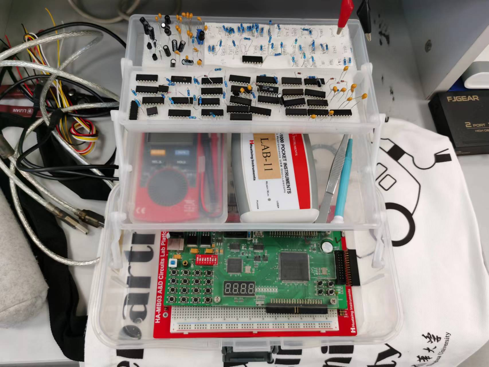

  

#
<big>FPGA设计入门 实验报告
   

  

###**
 自动化系**
###**
 李昭阳 2021013445**

##图形和数据处理

###多输出逻辑函数的原理图

###多输出逻辑函数的仿真波形

###电路逻辑功能

&ensp;&ensp;&ensp;
通过四个输出端口，分别表示AB、AB'、A'B、AB，将A & B逻辑运算在其所有输入情况下进行分类，使得电路可以根据A、B的不同输入情况做出不同的反应或处理。

###多输出逻辑函数的硬件描述语言

###硬件描述语言综合出的电路结构

##实验分析与思考

###使用 EDA 软件进行电路设计的流程

&ensp;&ensp;&ensp;
创建新的工程文件：File -> New Project Wizard -> 选取工程文件的路径 -> 调整芯片型号为EP2C5Q208C8
####**原理图设计模式：**
&ensp;&ensp;&ensp;
①新建 Block Diagram 文件
 
&ensp;&ensp;&ensp;
②双击图纸搜索所需元件
 
&ensp;&ensp;&ensp;
③将各类元件摆放好位置并连线
 
&ensp;&ensp;&ensp;
④用 Start Analysis & Synthesis 模式编译原理图文件
 
&ensp;&ensp;&ensp;
⑤新建 University Program VWF 文件
 
&ensp;&ensp;&ensp;
⑥双击 name 栏位，选择新窗口中的 Node Finder 并选择其中的List
 
&ensp;&ensp;&ensp;
⑦挑选所需的输入输出参数并应用
 
&ensp;&ensp;&ensp;
⑧按需求修改时间标尺并按需求修改输入端真值
 
&ensp;&ensp;&ensp;
⑨仿真出真值图

####**硬件描述语言设计模式：**
&ensp;&ensp;&ensp;
①新建 Verilog HDL File 文件
 
&ensp;&ensp;&ensp;
②根据需求编写硬件语言
 
&ensp;&ensp;&ensp;
③用 Start Analysis & Synthesis 模式编译原理图文件
 
&ensp;&ensp;&ensp;
④新建 University Program VWF 文件
 
&ensp;&ensp;&ensp;
⑤双击 name 栏位，选择新窗口中的 Node Finder 并选择其中的List
 
&ensp;&ensp;&ensp;
⑥挑选所需的输入输出参数并应用
 
&ensp;&ensp;&ensp;
⑦按需求修改时间标尺并按需求修改输入端真值
 
&ensp;&ensp;&ensp;
⑧仿真出真值图

###比较使用原理图输入方式和硬件描述语言输入方式进行电路设计的各自优势

&ensp;&ensp;&ensp;
原理图更加直观。对于简单电路而言，使用原理图的设计方式可以降低逻辑错误的概率，并且比硬件描述语言更易于表达。
 
&ensp;&ensp;&ensp;
硬件描述语言更适用于复杂电路的情况。对于规模较大的电路而言，原理图会过于复杂且难以解读，使用硬件描述语言可以减少电路的编写错误并增加文件的可读性。