  

#
<big>EDA02实验报告
   

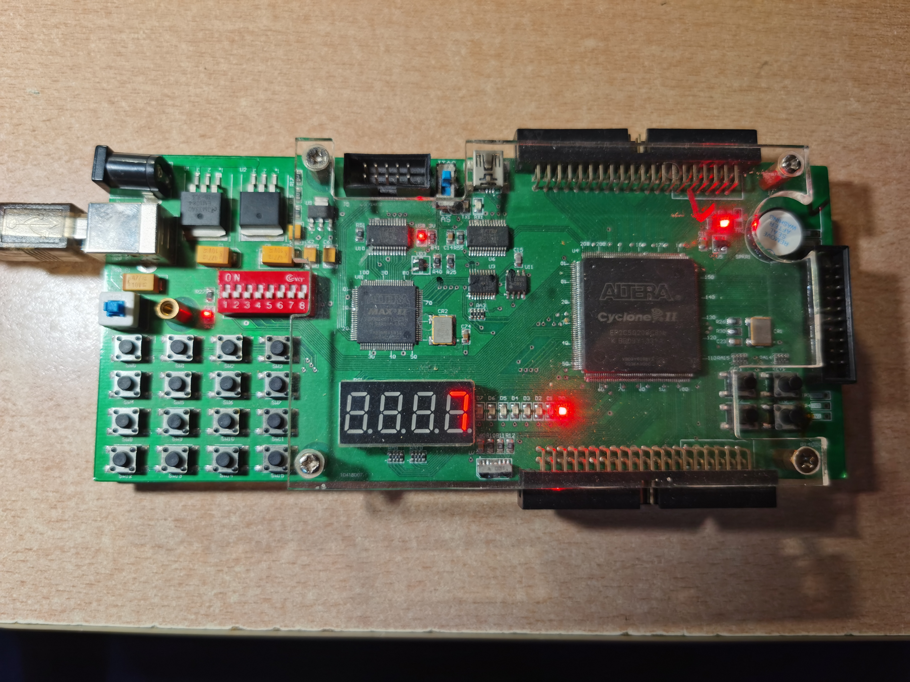

  

###**
 自动化系**
###**
 李昭阳 2021013445**

##电路设计

###（1）一位全加器设计图

$$S = A ⊕ B ⊕ CI$$
$$CO = ((A ⊕ B)CI)′(AB)′)$$
&ensp;&ensp;&ensp;
根据以上逻辑式可以满足全加器的功能，电路设计图如下。

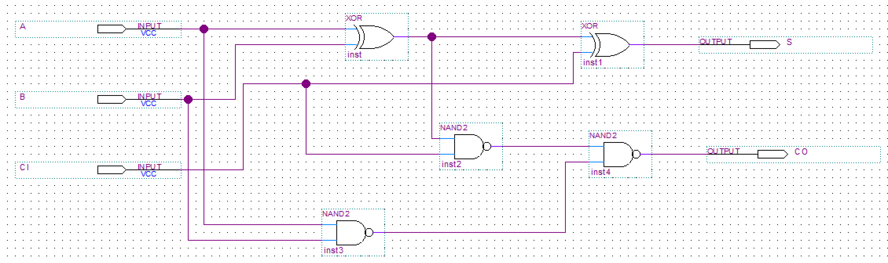
 
一位全加器
 

###（2）四位、五位全加器设计图

&ensp;&ensp;&ensp;
以一位全加器为基础可以分别实现四位、五位串行全加器其中 \\(A_0A_1A_2A_3(A_0A_1A_2A_3A_4)\\) 和 \\(B_0B_1B_2B_3(B_0B_1B_2B_3B_4)\\) 为输入第0、1、2、3（、4）位，\\(CI\\) 为前一位的进位，\\(S_0S_1S_2S_3(S_0S_1S_2S_3S_4)\\) 为输出第0、1、2、3（、4）位，\\(CO\\) 为运算产生的进位。电路设计图如下。

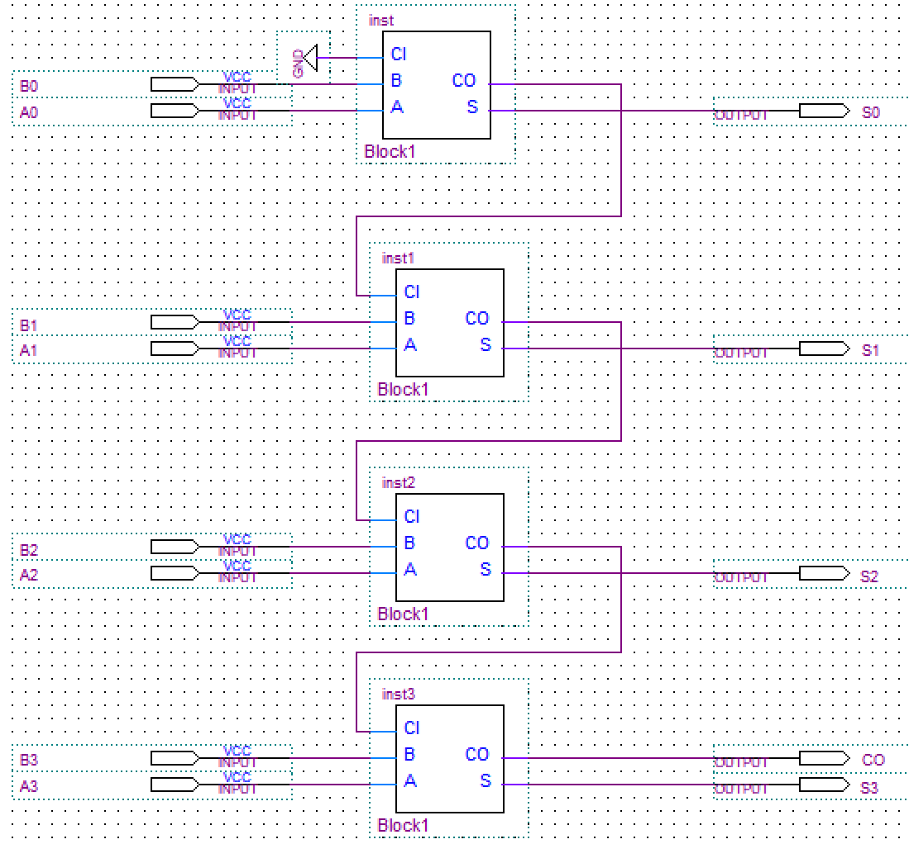
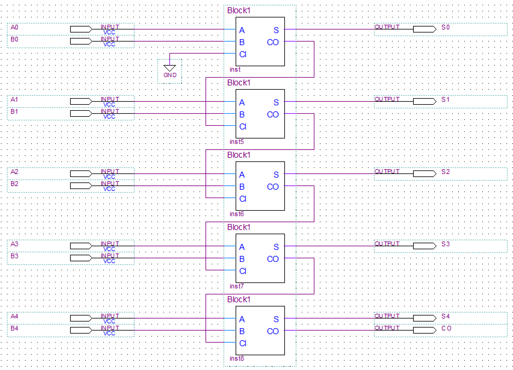
 
四位全加器&ensp;&ensp;&ensp;&ensp;&ensp;&ensp;&ensp;&ensp;&ensp;&ensp;&ensp;&ensp;&ensp;&ensp;&ensp;&ensp;&ensp;&ensp;&ensp;&ensp;&ensp;&ensp;&ensp;&ensp;&ensp;&ensp;&ensp;&ensp;&ensp;&ensp;五位全加器
 

###（3）四位、五位补码器设计图

&ensp;&ensp;&ensp;
通过异或门和一位全加器可以实现补码器。其中 \\(IN_0IN_1IN_2IN_3(IN_0IN_1IN_2IN_3IN_4)\\) 为需要取补码的第0、1、2、3（、4）位，\\(OUT_0OUT_1OUT_2OUT_3OUT_4\\) 为计算出补码的第0、1、2、3、4位。电路设计图如下。

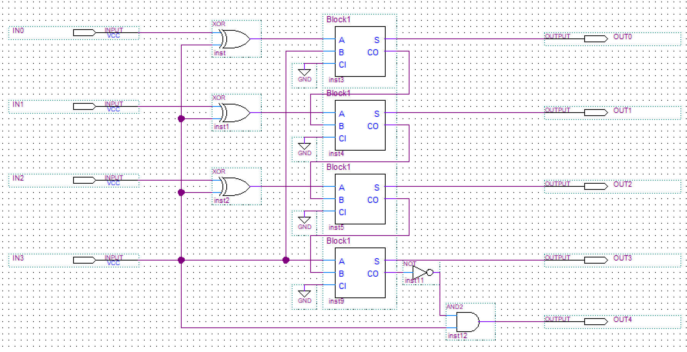
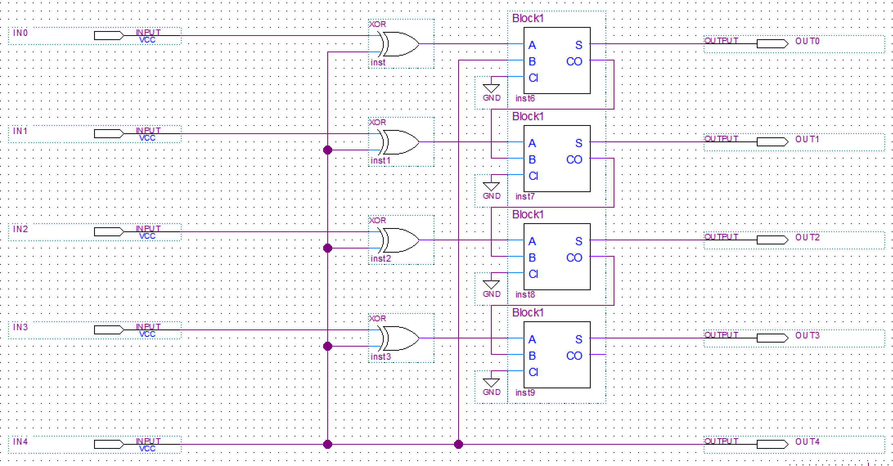
 
四位补码器&ensp;&ensp;&ensp;&ensp;&ensp;&ensp;&ensp;&ensp;&ensp;&ensp;&ensp;&ensp;&ensp;&ensp;&ensp;&ensp;&ensp;&ensp;&ensp;&ensp;&ensp;&ensp;&ensp;&ensp;&ensp;&ensp;&ensp;&ensp;&ensp;&ensp;&ensp;&ensp;&ensp;&ensp;&ensp;五位补码器
 

 
&ensp;&ensp;&ensp;
值得注意的是，在四位补码器中符号位\\(OUT_4\\)前加入了一个与门，若输入为1000，取补码和扩展为五位后，符号位会由1变为0。此举有效消除了1000的二进制输入带来的“-0”错误。而对于五位补码器，仅对于本电路而言，将不存在10000的输入，故在简化电路和降低传输延迟时间的考虑下，没有加入该结构。

###（4）运算器设计图

&ensp;&ensp;&ensp;
运算器可以有效实现四位有符号二进制数间的加运算。其原理是：分别将两个输入数的源码通过四位补码器转换并拓展为五位补码；再通过五位全加器实现加运算；最后通过一个五位补码器将运算结果转为源码，特分出符号位。电路设计图如下。

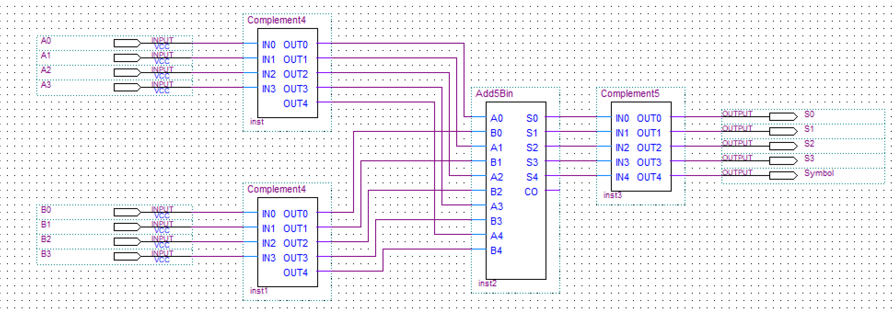
 
四位运算器
 

###（5）二进制-十进制转换器设计图

&ensp;&ensp;&ensp;
本部分电路可以实现四位无符号二进制数转为十进制数的操作。对于该十进制数的高位，由于电路功能的限制，仅需判断是否大于等于10（仅有101X、11XX、011X——若大于等于10，输出1；小于10，输出0。
 
&ensp;&ensp;&ensp;
首先设计了一个2选1数据选择器。对于该十进制数的低位，通过数据选择器，以输入所对应的十进制数是否大于等于10为标准，将数据分为两类——若小于10，则直接输出个位部分；若大于等于10，则对其加6，使得大于10的部分溢出，余留个位部分并输出。电路设计图如下。

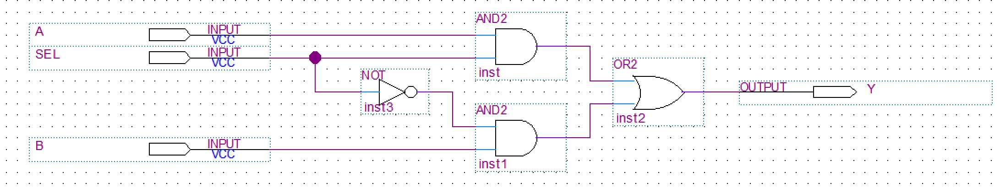
 
2选1数据选择器
 
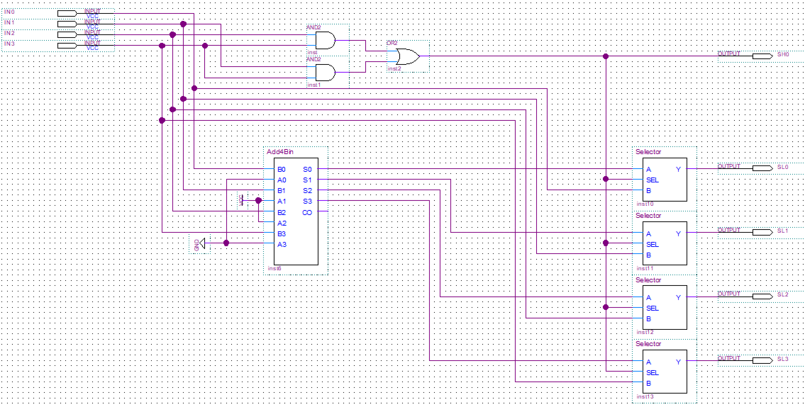
 
二进制-十进制转换器
 

###（6）16选4设计图

&ensp;&ensp;&ensp;
本部分是通过\\(KEY_0KEY_1\\)信号选择输出，其中 00 情况输出\\(SH_0SH_1SH_2SH_3\\)；01 情况输出\\(SL_0SL_1SL_2SL_3\\)；10 情况输出\\(M_0M_1M_2M_3\\)；11 情况输出\\(N_0N_1N_2N_3\\)。电路设计图如下。

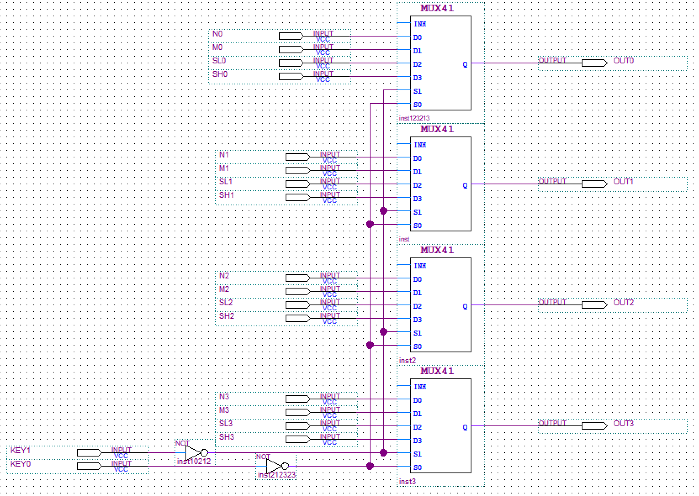
 
16选4设计图
 

###（7）数码管配套组件设计图

&ensp;&ensp;&ensp;
此部分是数码管显示时的一个配套电路。功能上，\\(IN_0IN_1IN_2IN_3\\) 控制7448对单个数码管的显示做输出；\\(KEY_0KEY_1\\) 是选通信号，其中 00 情况\\(DIG_3\\)显示；01 情况\\(DIG_2\\)显示；10 情况\\(DIG_1\\)显示)；11 情况\\(DIG_0\\)显示，值得注意的是，由于电路设计，在 01 和 10 情况时，\\(DIG_3\\)会被误触发，因此加入一个与门保证\\(DIG_3\\)选通情况唯一。电路设计图如下。

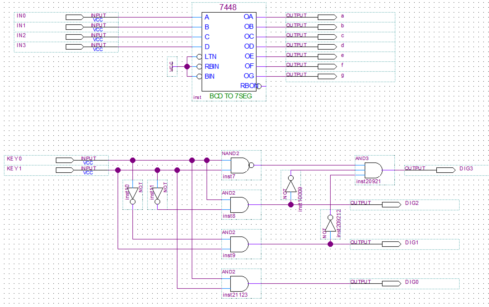
 
数码管配套组件设计图

###（8）整体设计图

&ensp;&ensp;&ensp;
整体电路图封装较为完整，作用是将输入进行加法运算（AddAndMinus）并转为十进制（BinToDec），再通过16选4选择器（FourMUX41）进行显示的选择，最后通过数码管配套组件（DIGLight）进行输出显示。
 
&ensp;&ensp;&ensp;
值得注意的是，LED灯显示负号的模块由于与输入联系过于紧密，故未进行单独封装。对于每一个数码管而言，都对应一个LED，当该数码管选通时，LED才可以显示负数。同时，对于在M和N的处理上加入了或门，当二者非符号位不全为0时，符号位为负才可能点亮LED，避免了输入1000产生“-0”。电路设计图如下。

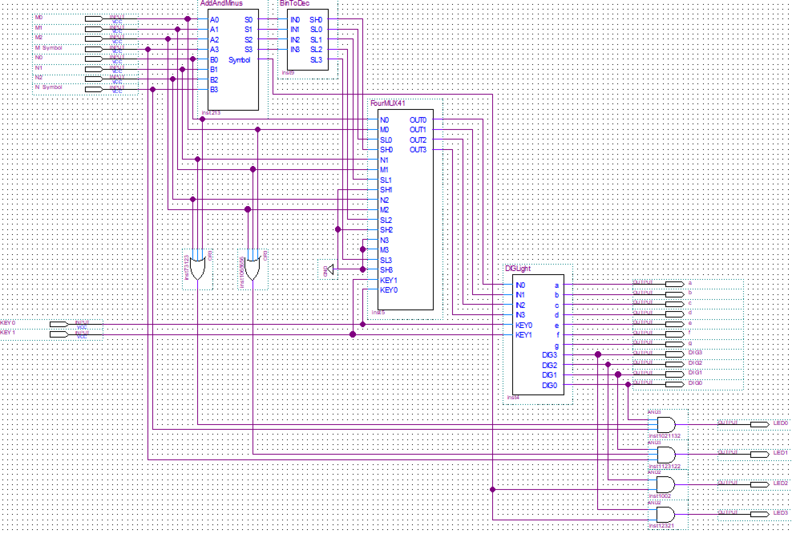
 
整体设计图

##波形图与验证文件

###一位全加器波形图

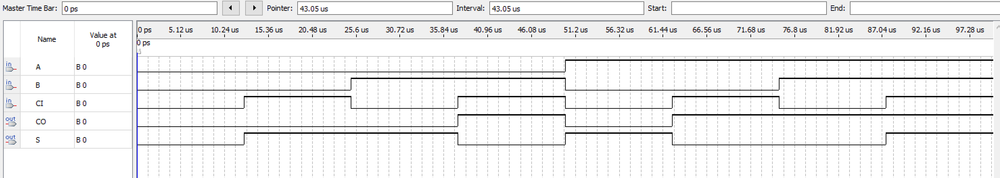
 
一位全加器波形图
 

###运算器波形图

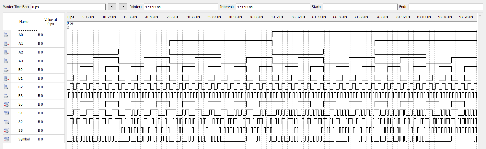
 
运算器波形图
 

&ensp;&ensp;&ensp;
本图中存在一个系统误差。由于时间划分的精确程度不够，导致每一层输入0或1的时间并不是严格的“上一个的1/2”，存在很小的误差，导致输出波形存在很多“毛刺”，但此并非“竞争-冒险”现象。
 
&ensp;&ensp;&ensp;
因此设计了test bench文件检测运算是否正确。检测功能仿真无误，时序仿真传输延迟时间 tpd 为20ns。

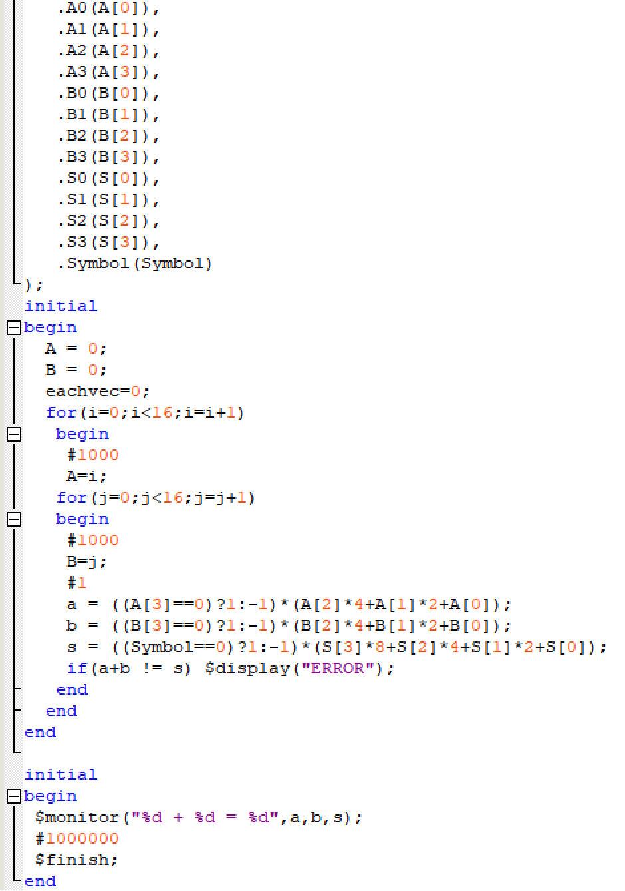
 
test bench文件代码
 

###顶层文件波形图

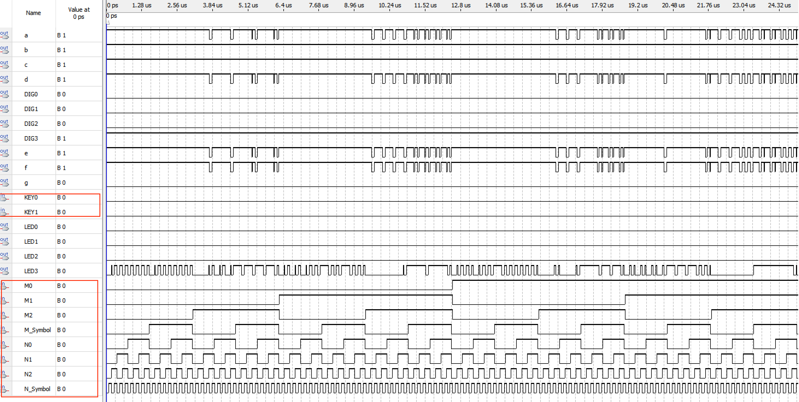
 
顶层文件波形图
 

&ensp;&ensp;&ensp;
图中红色圈出的变量为输入。本图依然存在系统误差，但由于直接下载至FPGA板中检测正常且基于运算器功能正确，故手动消除误差后可认为该波形符合要求。
##实验总结

###（1）总结使用 EDA 软件进行电路设计的流程

####**原理图设计模式：**
&ensp;&ensp;&ensp;
①新建 Block Diagram 文件
 
&ensp;&ensp;&ensp;
②双击图纸搜索所需元件，将各类元件摆放好位置并连线
 
&ensp;&ensp;&ensp;
③对于电路的部分层次化模块进行及时封装
 
&ensp;&ensp;&ensp;
④用 Start Analysis & Synthesis 模式编译原理图文件
 
&ensp;&ensp;&ensp;
⑤新建 University Program VWF 文件，使用波形测试功能（也可以编写test bench文件进行检测）
 
&ensp;&ensp;&ensp;
⑥功能仿真和时序仿真都通过后，为每个输入输出分配引脚地址
 
&ensp;&ensp;&ensp;
⑦下载到FPGA电路板上使用
####**硬件描述语言设计模式：**
&ensp;&ensp;&ensp;
①新建 Verilog HDL File 文件
 
&ensp;&ensp;&ensp;
②根据需求编写硬件语言
 
&ensp;&ensp;&ensp;
③对于电路的部分层次化模块进行及时封装
 
&ensp;&ensp;&ensp;
④用 Start Analysis & Synthesis 模式编译原理图文件
 
&ensp;&ensp;&ensp;
⑤新建 University Program VWF 文件，使用波形测试功能（也可以编写test bench文件进行检测）
 
&ensp;&ensp;&ensp;
⑥功能仿真和时序仿真都通过后，为每个输入输出分配引脚地址
 
&ensp;&ensp;&ensp;
⑦下载到FPGA电路板上使用

###（2）比较使用原理图输入方式和硬件描述语言输入方式进行电路设计的各自优势

&ensp;&ensp;&ensp;
原理图更加直观。对于简单电路而言，使用原理图的设计方式可以降低逻辑错误的概率，并且比硬件描述语言更易于表达。
 
&ensp;&ensp;&ensp;
硬件描述语言更适用于复杂电路的情况。对于规模较大的电路而言，原理图会过于复杂且难以解读，使用硬件描述语言可以减少电路的编写错误并增加文件的可读性。

###（2）在实验中遇到的问题及解决方法

&ensp;&ensp;&ensp;
在使用 \\(KEY_0KEY_1\\) 时未探究FPGA板上的按键按下是“1”还是“0”，导致一些未曾预期的显示错误。后经探究发现按键开关抬起代表“1”，成功修复bug。

###（3）此次实验的收获

&ensp;&ensp;&ensp;
•对电路进行模块化封装，加强了层次化设计的思维。
 
&ensp;&ensp;&ensp;
•体验了FPGA可编程逻辑器件的使用，培养了对电路设计的兴趣。

