  

#
<big>EDA03实验报告
   

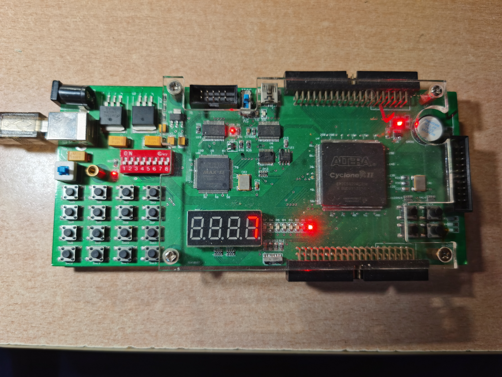

  

###**
 自动化系**
###**
 李昭阳 2021013445**

##充电仪模块设计与选择

###（1）分频器Clock

&ensp;&ensp;&ensp;
分频器模块的作用是将FPGA板的晶振产生的 50MHZ 的高频时钟信号降成 10000HZ 和 250HZ 的适合充电仪工作的较低频时钟信号，代码如下。

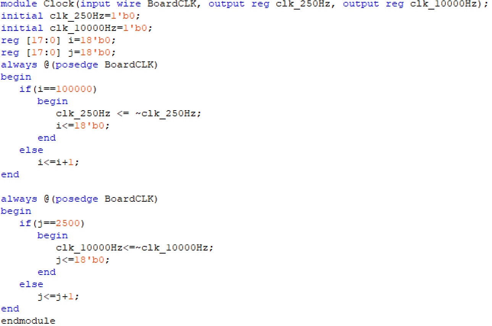

###（2）键盘扫描模块KeyBoard

&ensp;&ensp;&ensp;
该键盘扫描实现是，在每一个时钟信号下扫描键盘中的一列，如果这一列对应的行有某位为低电平，则将代表前一时钟键盘有按下的变量，last置为1。在接下来的时间内，如果该按键能够维持20次时钟脉冲，则认为该信号不是按键抖动的误触，实现了防抖。按键信息到输出数据的转换，是通过case语句进行实现的。大部分逻辑相似，故给出部分精简代码如下。

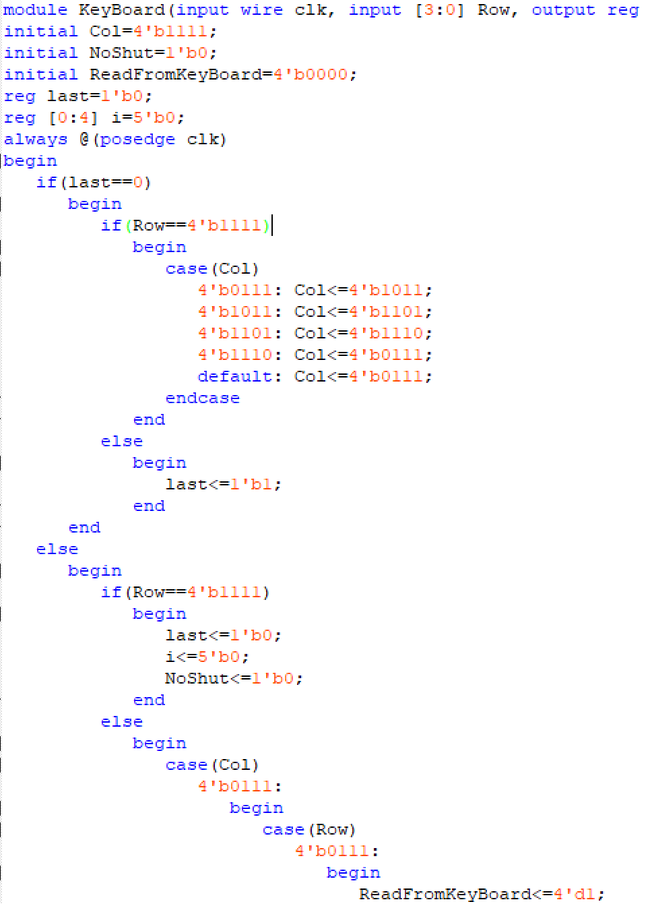
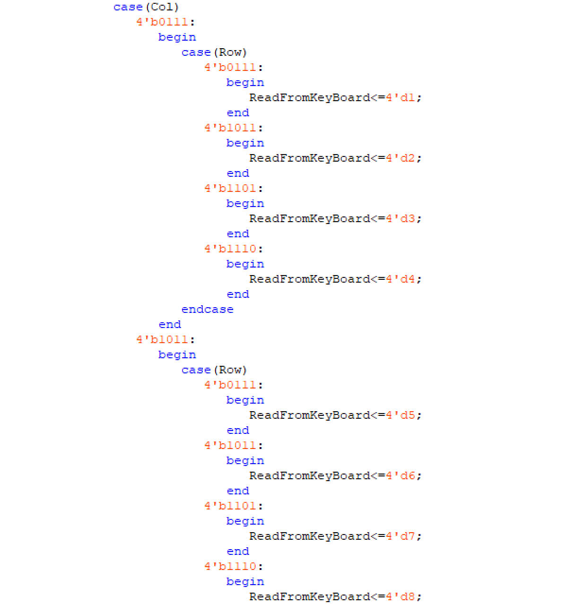

###（3）核心处理模块Core

&ensp;&ensp;&ensp;
状态机共四个状态，分别为初始状态Initial，开始输入的状态Start，表示已经输入至少一个数后状态的GetNum，表示充电倒计时的Counting。
在Initial状态下，当按下开始键后，进入Start状态；
 
&ensp;&ensp;&ensp;
在Start状态下，如果十秒没有按下任何按键，则返回Initial状态；如果有表示数字的按键按下，则进入GetNum状态；
 
&ensp;&ensp;&ensp;
在GetNum状态下，如果按清零键，则返回Start状态；如果按下确认键，则进入Counting状态；
 
&ensp;&ensp;&ensp;
在Counting状态下，当倒计时结束时，播放20秒音乐，播放结束后返回Initial状态。代码如下。

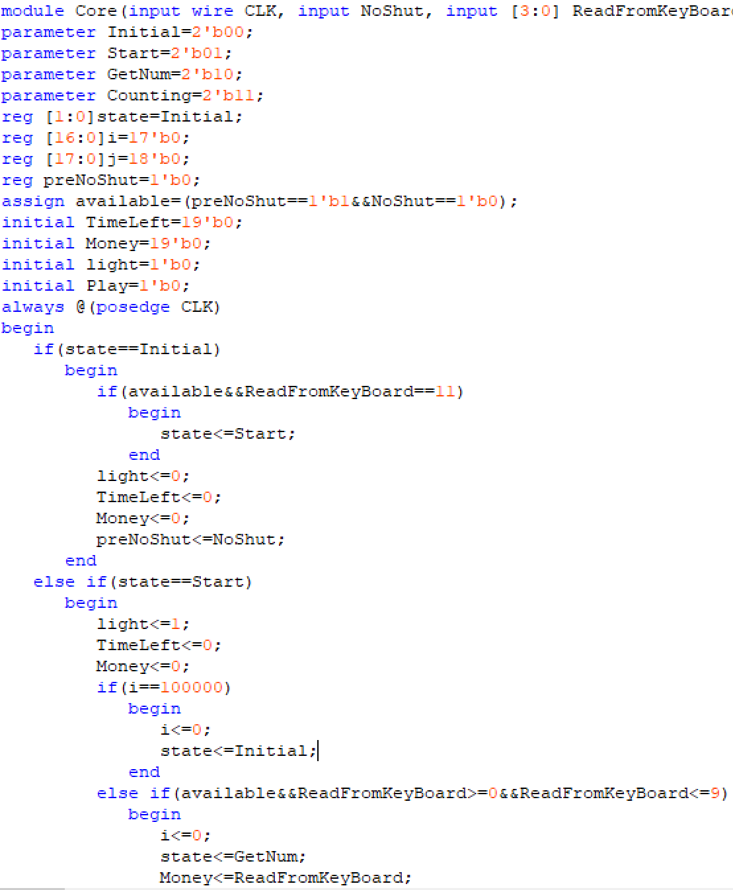
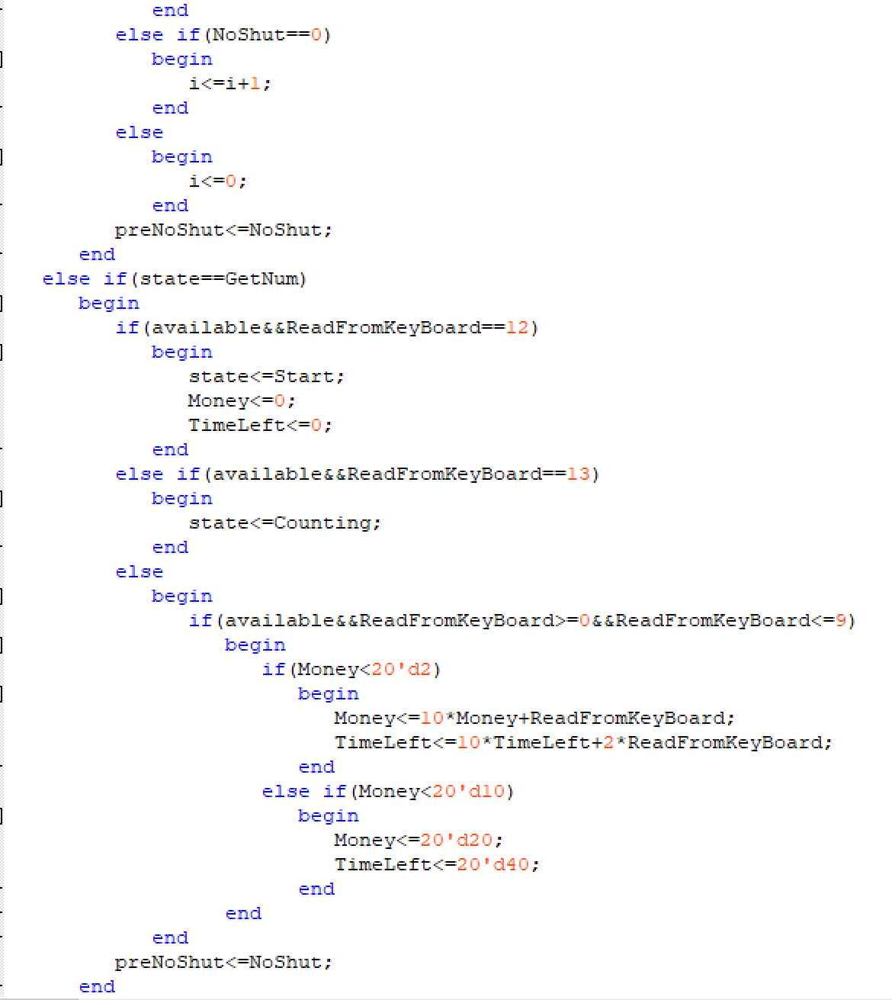
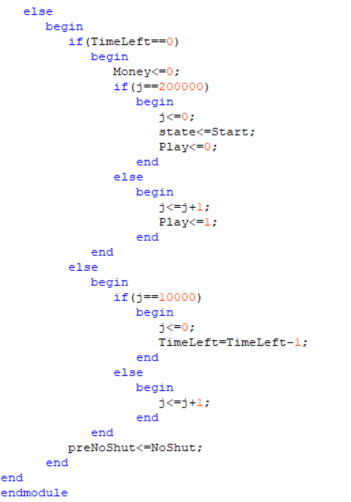

&ensp;&ensp;&ensp;
状态机如下。

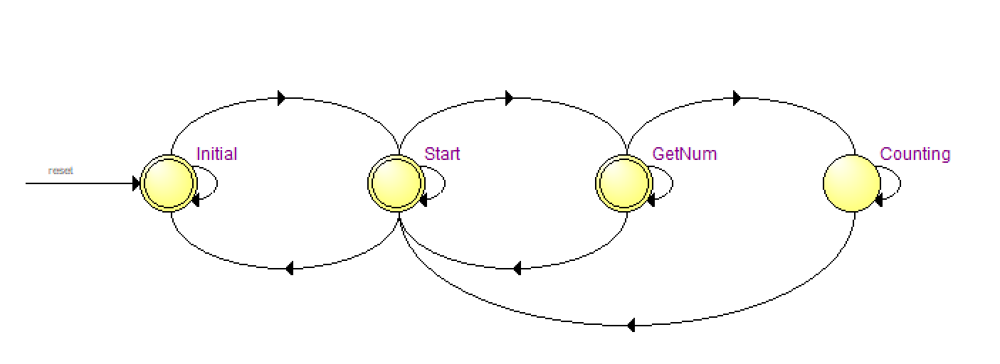

###（4）显示模块Show

&ensp;&ensp;&ensp;
该模块的作用是实时地将投币数和倒计时数显示在数码管上（Initial状态不显示）。通过高频选通信号扫描，利用视觉残留，使得数码管“假并真串”使数码管同时显现四个不同数字。代码如下。

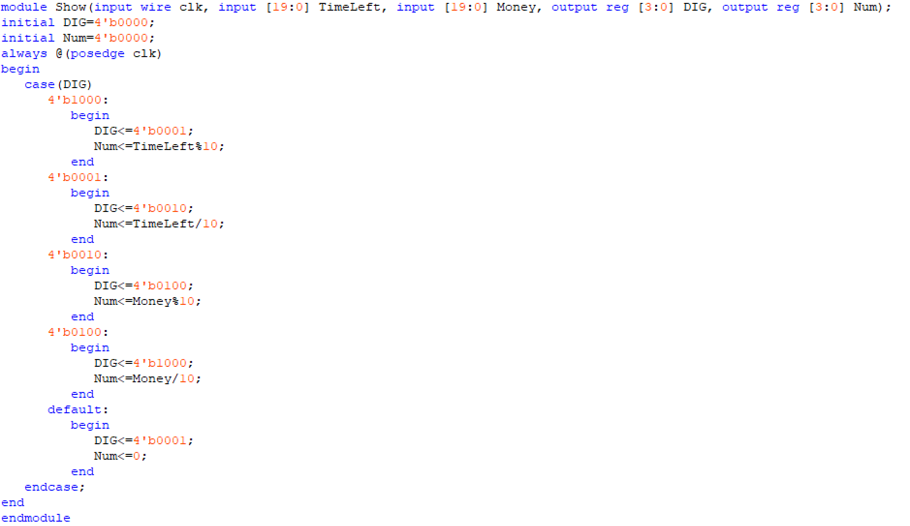

###（5）音乐播放模块Music

&ensp;&ensp;&ensp;
该模块的作用是播放一段20s的音乐，部分代码如下。

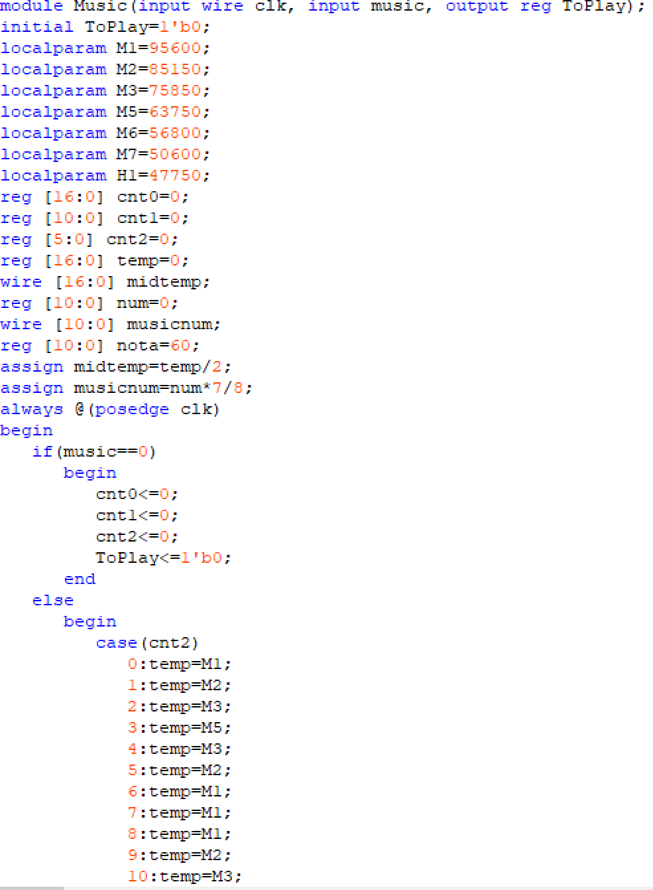
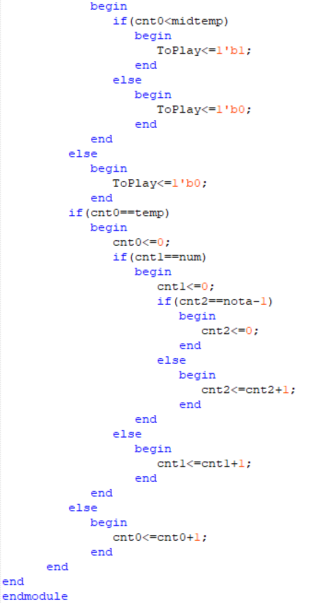

###（8）整体设计图

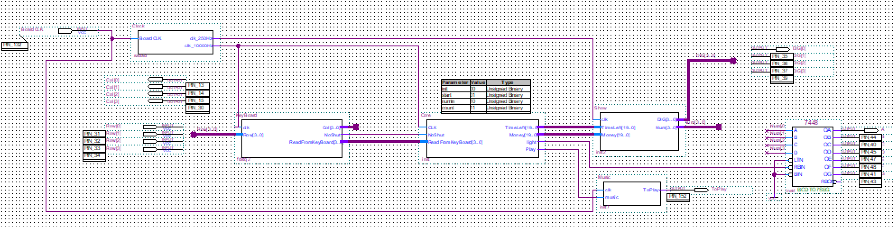

##波形图与验证文件

###键盘扫描模块仿真

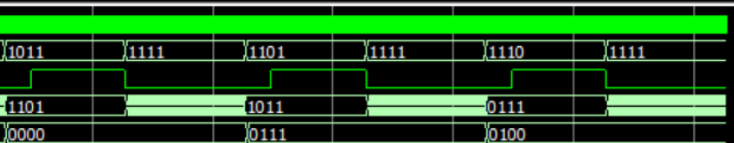

###核心模块仿真

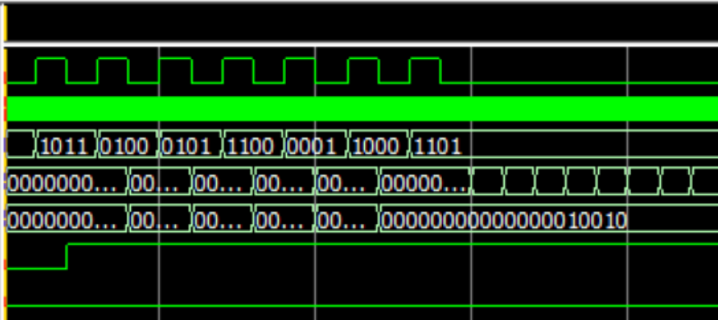
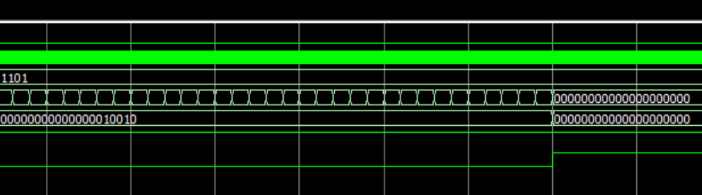

&ensp;&ensp;&ensp;
图中为开始、长按4、长按5、清零、长按1、长按8、确认。当按下开始键（“1011”）后进入数字输入状态。长按数字键（“0100”和“0101”），输出相应的金额和时间；按下清零键（“1100”），金额和时间被清零；再按下数字键（“0001”和“0100”）重新输入金额和时间。仿真符合预期的需求。按下确认键（“1101”）后，进入计时状态，充电时间逐渐减小，减为0时，播放音乐。音乐播放结束，变回输入状态，然后经过10s，数码管熄灭，变为初始状态。仿真与预期相符，设计合理。
##总结
&ensp;&ensp;&ensp;
通过本次实验，我对verilog语言的理解更加深刻，也逐渐脱离原理图进行纯语言的设计。我相信这次EDA3作业培养了我可编程逻辑器件的操作能力，同时在解决bug的过程中也锻炼了我的耐心和查阅资料的能力。

