  

#
<big>常用电子仪器的使用实验报告
   

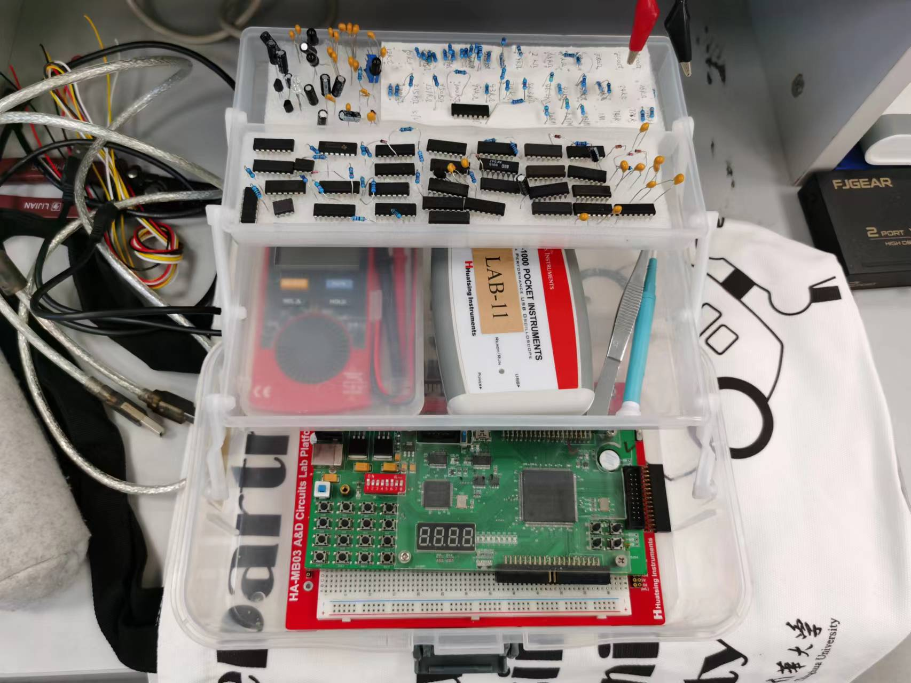

  

###**
 自动化系**
###**
 李昭阳 2021013445**

##必做一

###（1）原始数据

&ensp;&ensp;&ensp;
示波器水平定标 &emsp;200 μS/DIV
 
&ensp;&ensp;&ensp;
周期 \\(T\\) &emsp;&emsp;&emsp;&emsp;&emsp;1.0 mS
 
&ensp;&ensp;&ensp;
脉宽 \\(t_w\\)&emsp;&emsp;&emsp;&emsp;&emsp;0.5 mS
 
&ensp;&ensp;&ensp;
示波器垂直定标 &emsp;0.5 V/DIV
 
&ensp;&ensp;&ensp;
幅度 &emsp;&emsp;&emsp;&emsp;&emsp;&emsp;2.49 V
 
&ensp;&ensp;&ensp;
示波器的触发源 &emsp;1 通道

###（2）手绘波形图和原始数据图

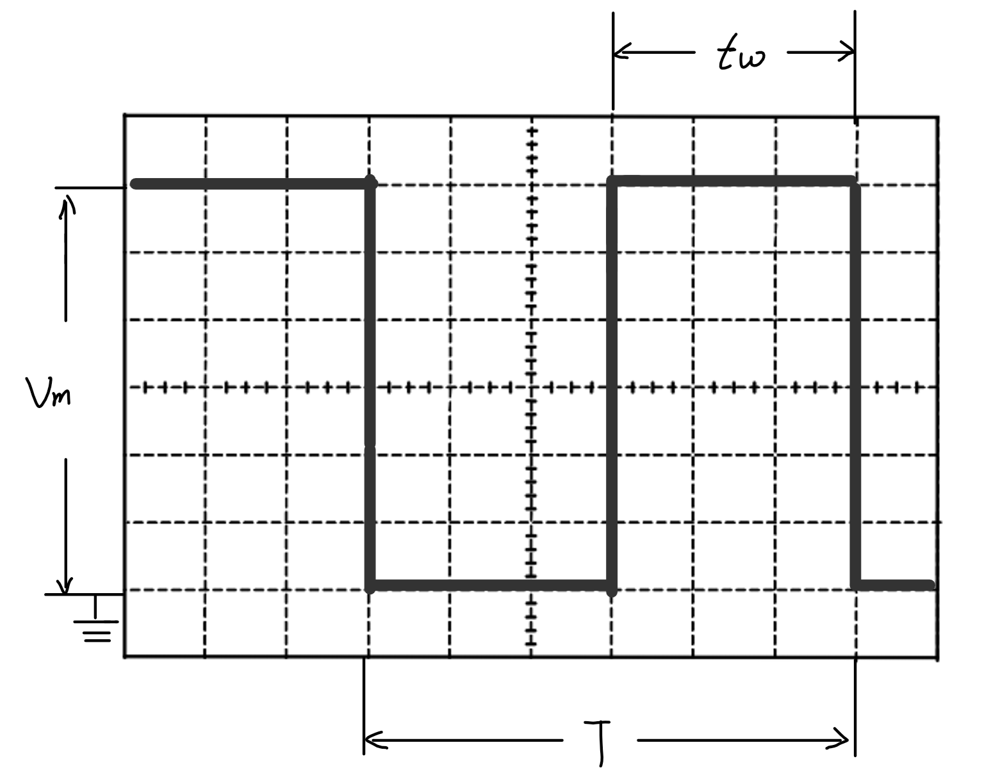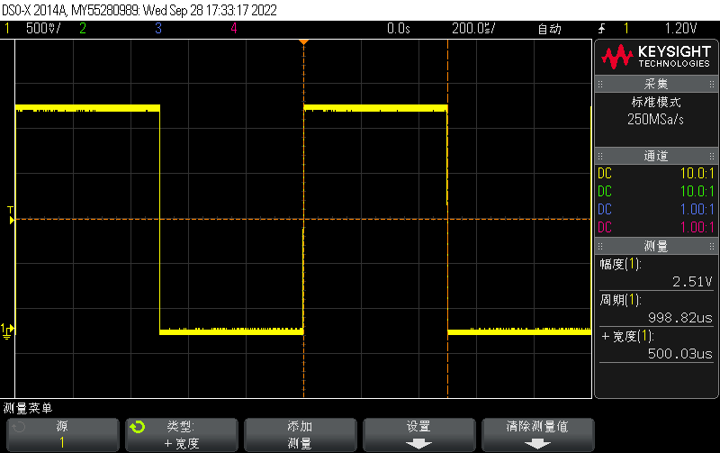

##必做二

###（1）原始数据

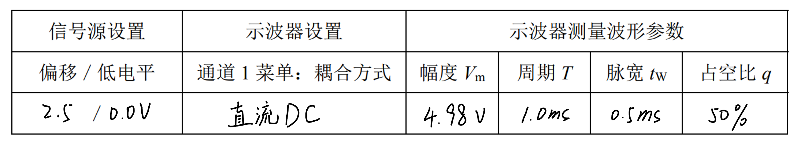

##必做三

###（1）原始数据

&ensp;&ensp;&ensp;
示波器水平定标 &emsp;7 nS/DIV
 
&ensp;&ensp;&ensp;
上升时间 \\(t_r\\) &emsp;&emsp;&emsp;14.1 nS
 
&ensp;&ensp;&ensp;
触发源 &emsp;&emsp;&emsp;&emsp;&emsp;1
 
&ensp;&ensp;&ensp;
触发斜率 &emsp;&emsp;&emsp;&emsp;上升沿
 
&ensp;&ensp;&ensp;
下降时间 \\(t_f\\) &emsp;&emsp;&emsp;15.1 nS
 
&ensp;&ensp;&ensp;
触发斜率 &emsp;&emsp;&emsp;&emsp;下降沿

###（2）手绘波形图和原始数据图

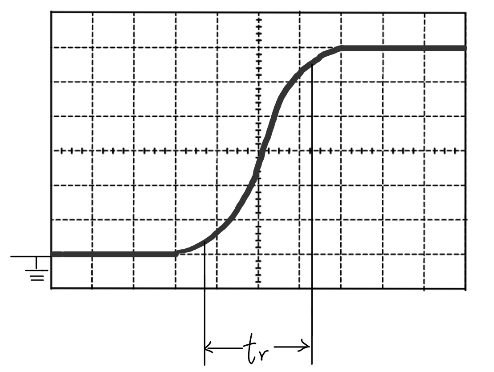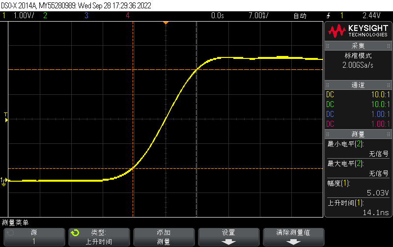
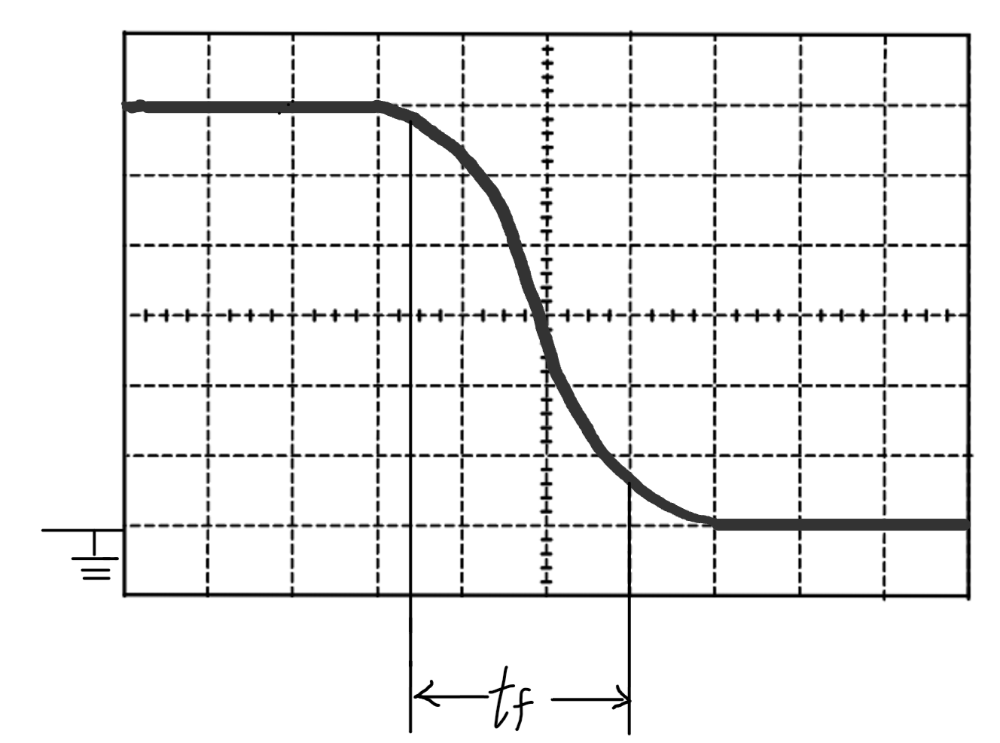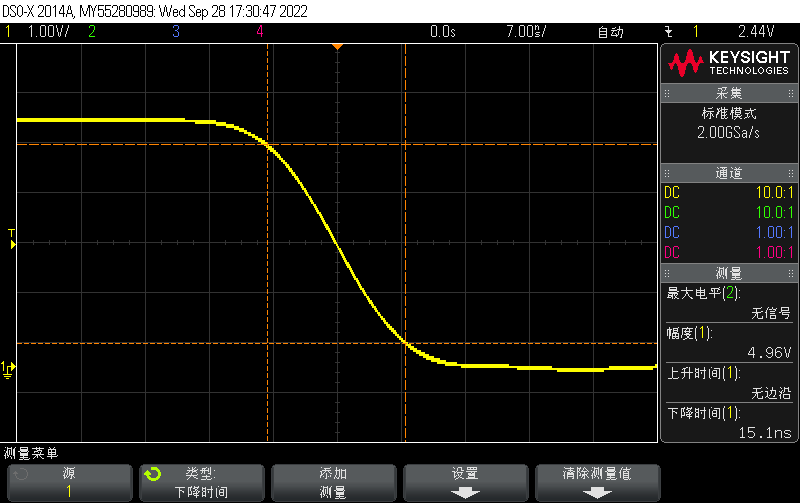
 
**上2图是上升时间数据图**
 
**下2图是下降时间数据图**

##必做四

###（1）原始数据

&ensp;&ensp;&ensp;
vm2 的高电平 &emsp;4.98 V
 
&ensp;&ensp;&ensp;
vm2 的低电平 &emsp;-0.16 V
 
&ensp;&ensp;&ensp;
输入耦合方式 &emsp;直流DC
 
&ensp;&ensp;&ensp;
触发源 &emsp;&emsp;&emsp;&emsp;&emsp;2

###（2）手绘波形图和原始数据图

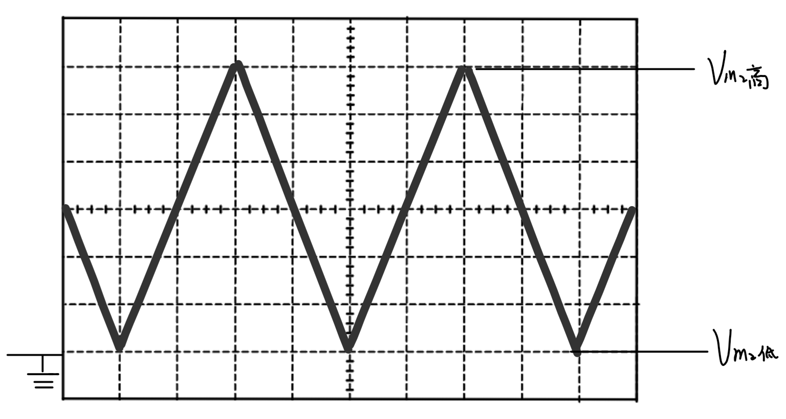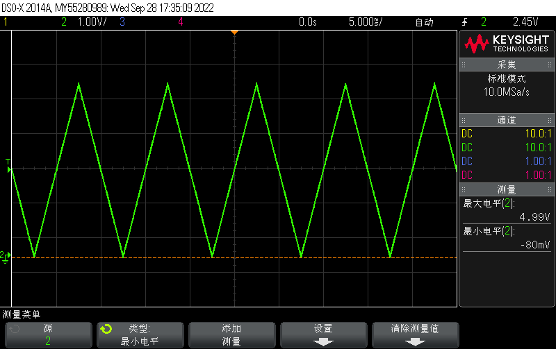

###（3）改变示波器通道 2 菜单中的输入耦合方式为“AC”，观察实验现象。以文字说明或图片形式记录实验现象。

&ensp;&ensp;&ensp;
耦合方式改为"AC"后，信号的直流分量被屏蔽，同时零电平位于高低电平平均值附近。 \\(v_{m2}\\) 的高电平 2.41 V，低电平 -2.57 V，波形整体下移。

###（4）恢复“DC”耦合方式之后，调节信号源的输出波形【对称度】，观察波形的变化。以文字说明或图片形式记录实验现象。

&ensp;&ensp;&ensp;
当对称度 < 50% 时，上升沿的斜率增大，下降沿斜率减小；当对称度 > 50% 时，上升沿的斜率减小，下降沿斜率增大；

##必做五

###（1）在示波器时基模式为“标准”（YT）模式时，观测并记录波形。

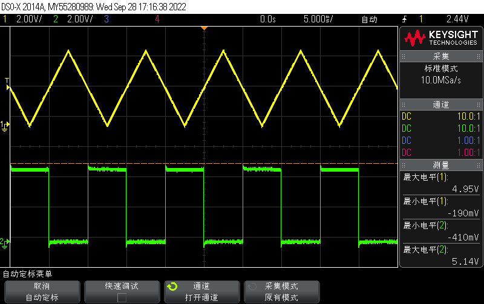
 
**图中通道1（黄色）是\\(v_I\\)，通道2（绿色）是\\(v_O\\)**

###（2）在示波器时基模式为“XY”时，观测并记录波形。

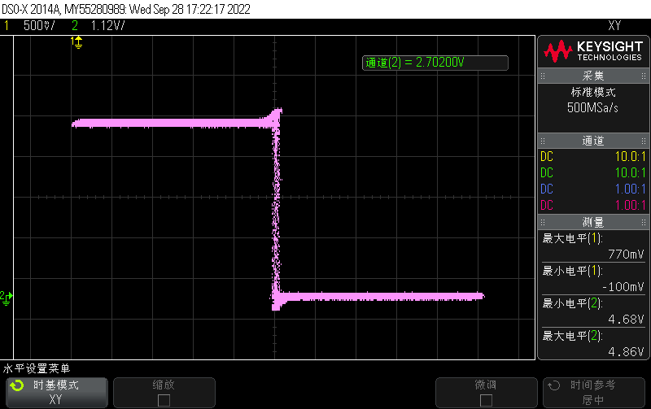

###（3）对照两种模式下的波形，试分析波形之间的对应关系。

&ensp;&ensp;&ensp;
两波形之间对应关系如下图所示。标定了一个周期内的多个关键取值点，多周期可以以此类推。在一个周期内，随着时间的推移，绘制X-Y图的顺序为点① -> ② -> ③ -> ④ -> ⑤，存在往复过程。

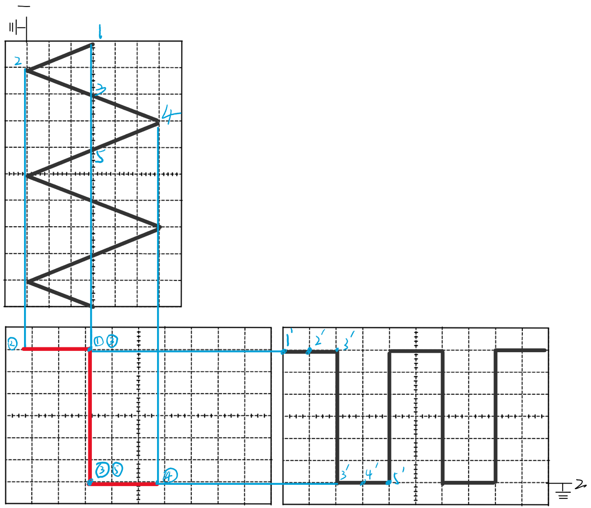

##选做一

###（1）当输入信号 \\(V_{I1} = sin(2\pi \times 100 \times 10^3) V\\) 时，先后用示波器通道 1 探头的 ×1 档和 ×10 档测量输出电压 v0。

&ensp;&ensp;&ensp;
\\(\times1档 : v_O = 0.95V\\)
 
&ensp;&ensp;&ensp;
\\(\times10档 : v_O = 1.31V\\)

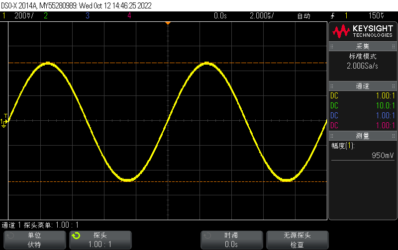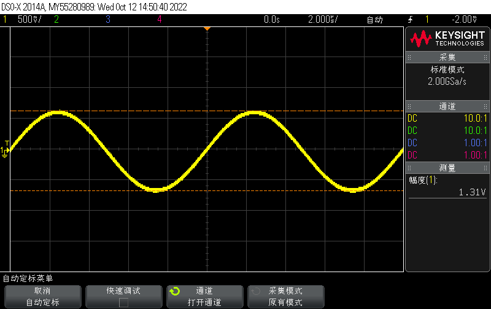
 
**左图是\\(\times1 档\\)&emsp;右图是\\(\times10 档\\)**

###（2）当输入信号 \\(V_{I1} = sin(2\pi \times 500 \times 10^3) V\\) 时，重复上述操作。

&ensp;&ensp;&ensp;
\\(\times1档 : v_O = 0.54V\\)
 
&ensp;&ensp;&ensp;
\\(\times10档 : v_O = 1.2V\\)
 
&ensp;&ensp;&ensp;
数据图与（1）中基本相似，故省略而仅列出数据。

###（3）总结示波器输入电容对测量结果的影响及如何正确选用探头的 ×1 档与 ×10 档。

&ensp;&ensp;&ensp;
由容抗的计算公式\\(X_c = \frac{1}{2\pi fC}\\)可知，对于电路而言，频率越高，容抗越低。对于高频信号而言，容抗对信号的消耗远远小于阻抗对信号的消耗，故大部分信号可以“通过”输入电容进入示波器，即输入电容为高频交流信号提供了一个消耗更少的“通路”，使得信号测量更为准确。同时由于电容的不同，充放电时间常数 \\(\tau\\) 不同，使得上升、下降时间存在差异。
 
&ensp;&ensp;&ensp;
\\(\times1档\\)更适用于低频小信号，其余应采用\\(\times10档\\)。两档均对输入信号有影响，但\\(\times 1\\)档对高频信号的误差更大。对于高幅值信号而言，\\(\times10档\\)对输入信号做了10倍衰减处理，使得示波器的量程扩大了十倍；对于高频信号而言，\\(\times10档\\)的带宽要高于\\(\times1档\\)，故在\\(\times10档\\)当下显示的一些高频信号才是正确信号。
##选做二

###（1）在示波器时基模式为“标准”（YT）模式时，测量 vI、vO的幅度及它们之间的相位差，记录波形和数据。

&ensp;&ensp;&ensp;
\\(v_I = 5.2V\\)
 
&ensp;&ensp;&ensp;
\\(v_O = 2.89V\\)
 
&ensp;&ensp;&ensp;
\\(\phi = 49^{\circ}\\)

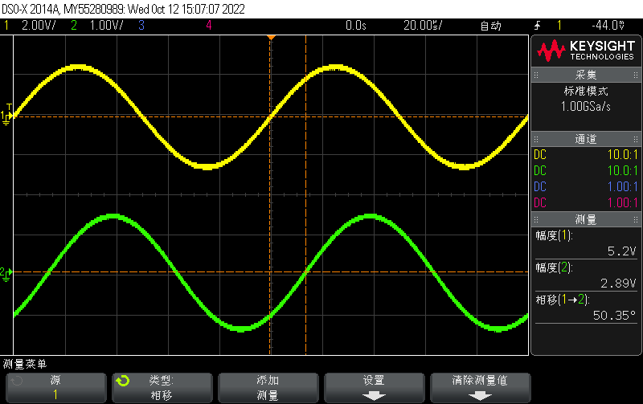
 
**图中通道1（黄色）是\\(v_I\\)，通道2（绿色）是\\(v_O\\)**

###（2）在示波器时基模式为“XY”时，测量与记录内容同（1）。

&ensp;&ensp;&ensp;
\\(v_I = 5.27V\\)
 
&ensp;&ensp;&ensp;
\\(v_O = 2.89V\\)
 
&ensp;&ensp;&ensp;
\\(\phi = 50^{\circ}\\)

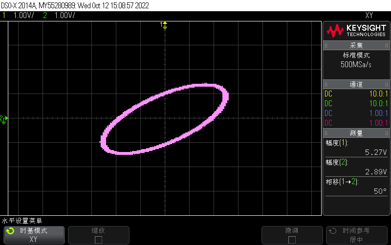

##思考题

###（1）能否用带宽为 100MHz 的示波器准确观测到 100MHz 的矩形脉冲信号？如不行，请推荐所用示波器的带宽。

&ensp;&ensp;&ensp;
不可以。根据傅里叶分解频谱分析，应当观测至少矩形脉冲五次以上的谐波，如果用带宽为 100MHz 的示波器观测 100MHz 的矩形脉冲信号，则其失真严重，难以准确观测。一般选用示波器的带宽应该是矩形波最大频率的五倍，即用带宽为 500MHz 的示波器才可以准确观测到 100MHz 的矩形脉冲信号。

###（2）在电子电路实验中，为什么电子仪器要与被测电路共地？

&ensp;&ensp;&ensp;
主要是为了有统一的参考0电位点。同时，电子仪器和被测电路同时工作时，即使它们使用的是同一电源，由于不同的电路设计和元器件品质的差异，也会在产生微小的电位差或者离散电容，这样就会对被测目标的读数产生干扰，使用共地点可以减小这种测量误差。

###（3）示波器“通道菜单”的输入耦合方式分为直流（DC）耦合和交流（AC）耦合。试写出如测量图 8（a）、（b）、（c）三种波形，各应选择哪种输入耦合方式。

&ensp;&ensp;&ensp;
（a）应当选用直流DC耦合，信号存在较多直流分量；
 
&ensp;&ensp;&ensp;
（b）应当选用交流AC耦合，信号存在较少直流分量；
 
&ensp;&ensp;&ensp;
（c）应当选用直流DC耦合，信号存在较多直流分量。
##实验总结

###（1）示波器测量各波形参数的方法。

&ensp;&ensp;&ensp;
对于粗略的参数测量，可以使用示波器面板上的“mess”键，调用内部的自动测量。对于精度较高或特殊要求的参数测量，先调节水平、垂直定标旋钮，使得脉冲占满整数大格之间。然后使用示波器面板上的“Cursors”键，调整不同光标的位置，以读取差值或光标值。
 

**常用的参数测量方法**

 
直流电压 \\(V = S_Y \times H \times k\\)，\\(S_Y\\) 为示波器垂直定标旋钮的位置，\\(H\\) 为直流电平与零电平之间的距离，\\(k\\)为示波器探头的倍增系数。
 
脉冲周期 \\(T = W \times L_x\\)，\\(W\\) 为水平定标旋钮的位置，\\(L_x\\) 两个方向相同的过零点之间的距离。
 
脉冲幅度 \\(v_m\\)：脉冲电压的最大变化量。
 
脉冲宽度 \\(t_w\\)：从脉冲前沿到达 \\(0.5v_m\\) 起，到脉冲后沿到达 \\(0.5v_m\\) 止的一段时间。
 
上升时间 \\(t_r\\)：脉冲上升沿从 \\(0.1v_m\\) 上升到 \\(0.9v_m\\) 所需的时间。（须在上升沿测量）
 
下降时间 \\(t_f\\)：脉冲下降沿从 \\(0.9v_m\\) 下降到 \\(0.1v_m\\) 所需的时间。（须在下降沿测量）
 
占空比 \\(q\\)：脉冲宽度与脉冲周期的比值，亦即 \\(q = \frac{t_w}{T}\\) 。
 
相位差 \\(\phi = 360^{\circ} \times \frac{L_x}{T}\\), \\(L_x\\)为两信号同一相位点之间的距离。

###（2）根据必做任务 4，归纳总结选取示波器“通道菜单”中输入耦合方式（DC/AC）的原则。

&ensp;&ensp;&ensp;
耦合方式为“直流DC”：被测信号的直流分量和交流分量可通过，一般用于测量信号的绝对电压值和观测极低频信号；
 
&ensp;&ensp;&ensp;
耦合方式为“交流AC”：被测信号的直流分量被阻隔，可使用更高的灵敏度显示信号的 AC 分量，一般用于观测有较大的直流偏移的信号和精确观测信号的交流分量。
 
&ensp;&ensp;&ensp;
选取耦合方式时应该明确观测重点，如果重点在于信号整体，则选用“直流DC”；如果重点在于交流分量，则应该选取“交流AC”。

###（3）通过此次实验，其他需要总结的测试方法、注意事项或解决方案等。

&ensp;&ensp;&ensp;
① 示波器的波形不稳定，大致原因是示波器的触发电平未设置到信号的有效范围内，可以通过调节触发控制旋钮进行调节。如果未对触发电平有特殊要求，可以直接按下“Auto Scale”键进行自动调节。
 
&ensp;&ensp;&ensp;
② 调节不同通道的水平控制旋钮和垂直控制旋钮可以移动屏幕上的波形，配合水平定标旋钮、垂直定标旋钮可以将信号图移到屏幕正中间并放大展开易于观察。

##反思
&ensp;&ensp;&ensp;
本次实验中，各项试验的完成度较好，同时收集的各项数据也比较精准、易于分析结论。但我对面包板的使用不够熟悉，在搭建实验电路时忘记将芯片通电和接地，同时接线长度计算经验不足，接线较乱。不过我认为在以后的实验过程中，我会逐渐熟悉面包板的操作，同时也会在以后的实验过程中更加谨慎，以保证实验安全且准确。