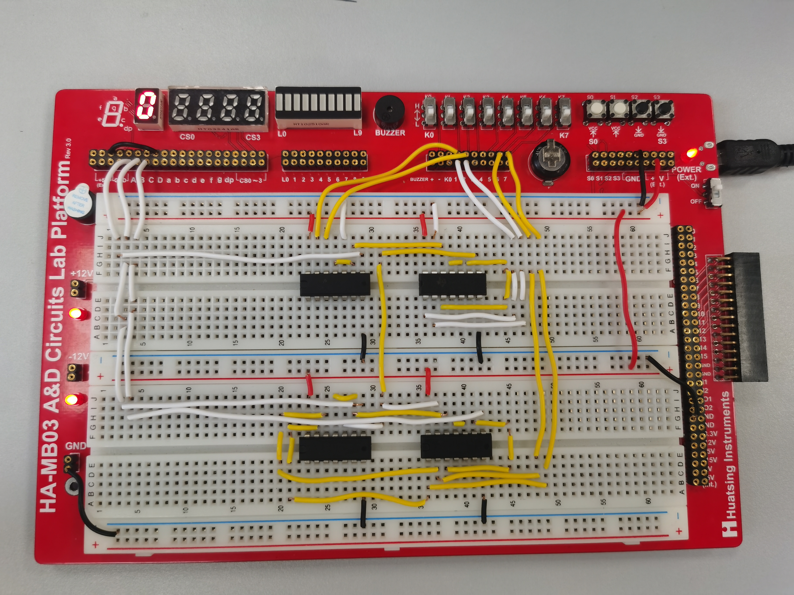
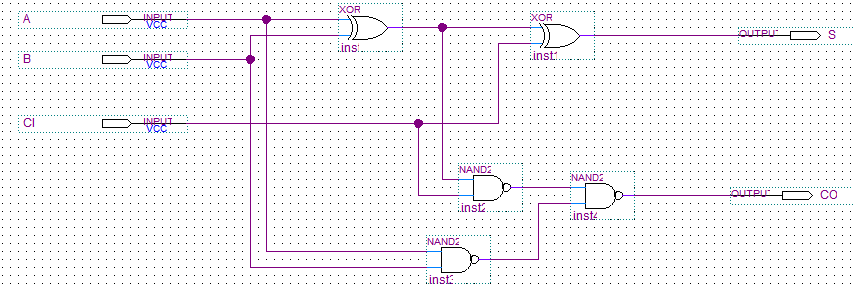
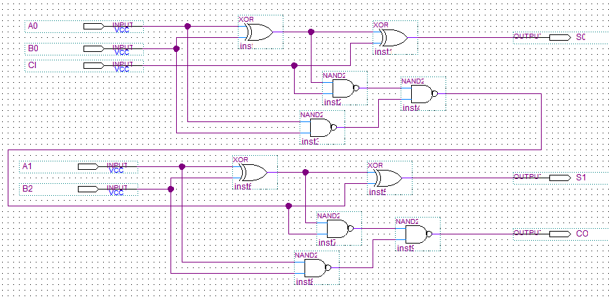
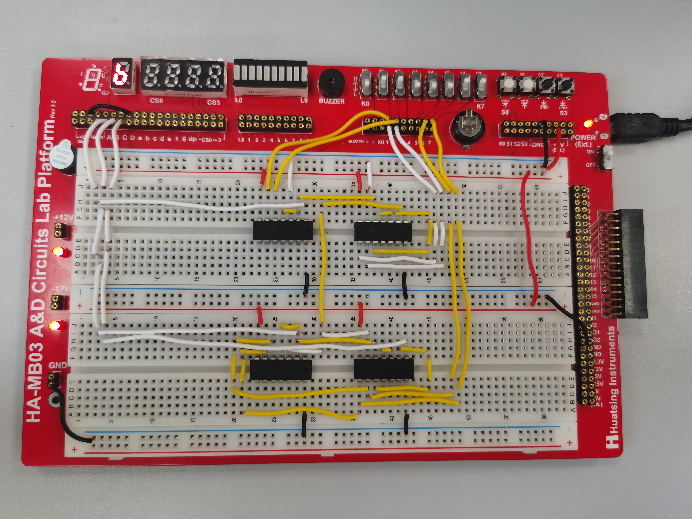
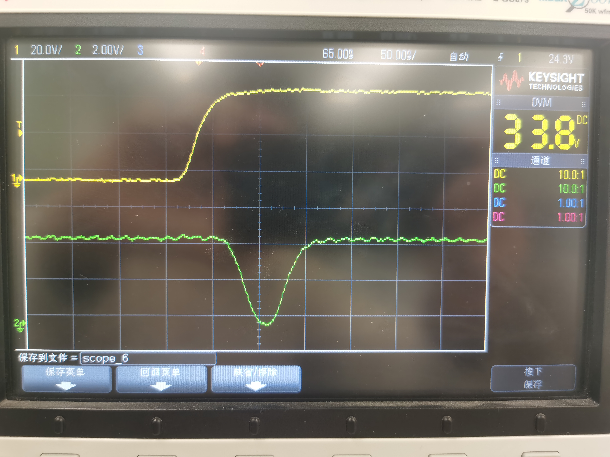
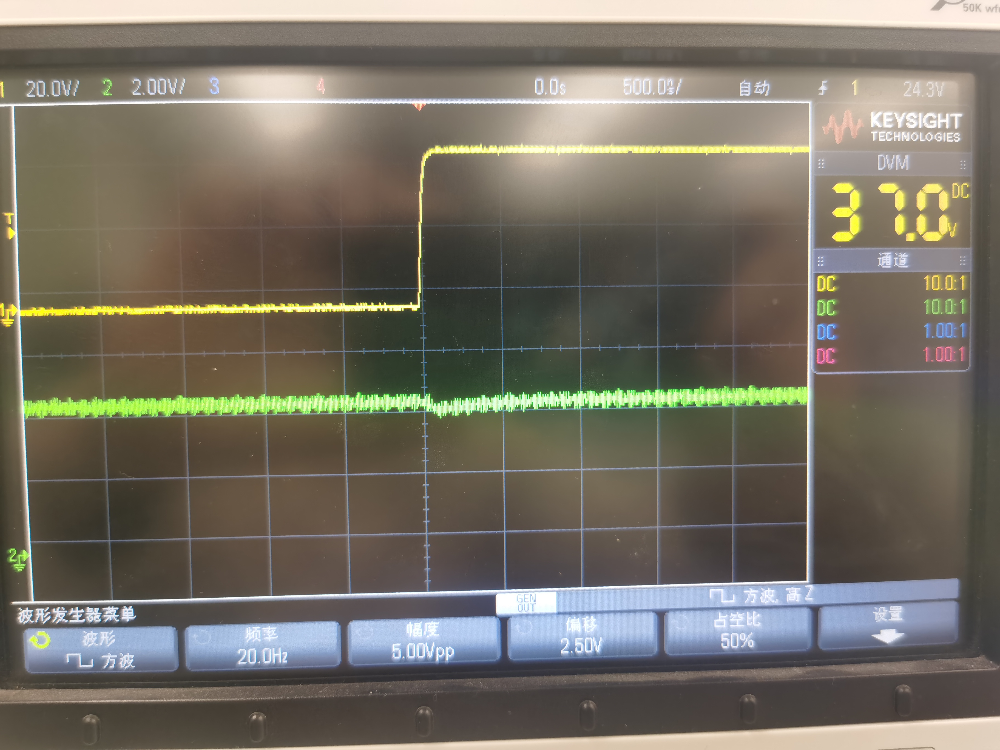
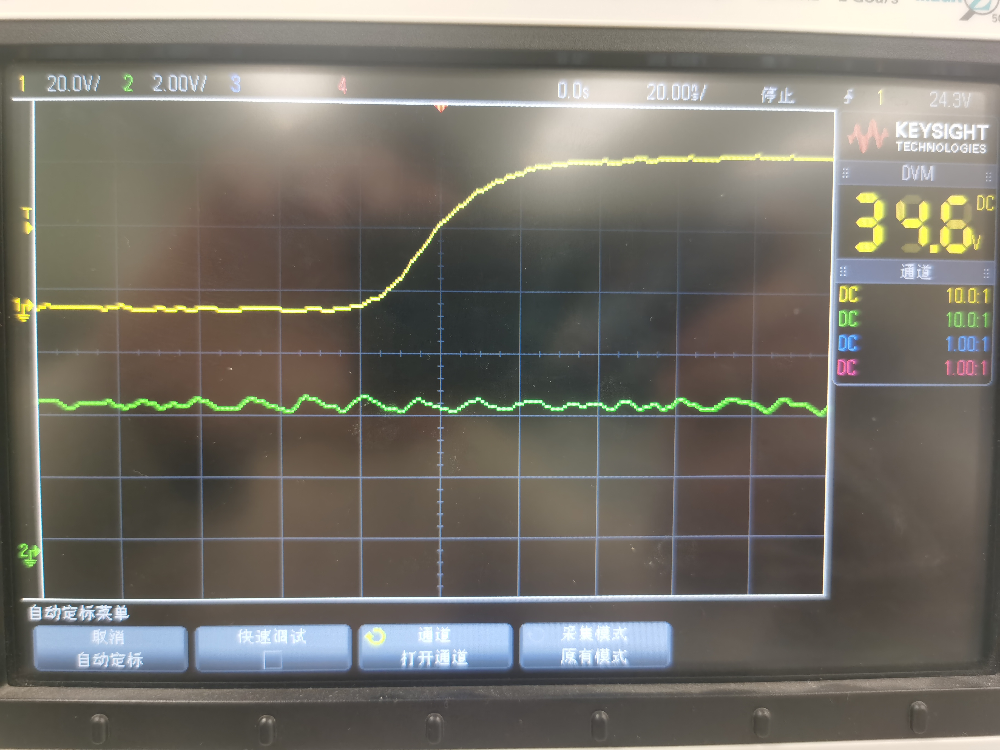
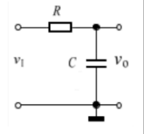

  

#
<big>组合逻辑电路的设计实验报告
   

  

###**
 自动化系**
###**
 李昭阳 2021013445**

##必做任务

###（1）一位全加器逻辑原理

$$S = A ⊕ B ⊕ CI$$
$$CO = ((A ⊕ B)CI)′(AB)′)$$

###（2）一位全加器原理设计图

###（3）两位全加器逻辑原理

$$S_0 = A_0 ⊕ B_0 ⊕ CI$$
$$CO_1 = (((A_0 ⊕ B_0)CI)′(A_0B_0)′)′$$
$$S_1 = A_1 ⊕ B_1 ⊕ CO_1$$
$$CO = (((A_1 ⊕ B_1)CO_1)′(A_1B_1)′)′$$

###（4）两位全加器原理设计图

###（5）面包板连接图

&ensp;&ensp;&ensp;
如上图，\\(00 + 00 = 00\\)，转为十进制为0，实验板现象符合预期；\\(11 + 11 = 110\\)，转为十进制为6，实验板现象符合预期。
##选做任务

###处理前实验波形图

&ensp;&ensp;&ensp;
如图所示，当\\(V_I\\)从0变为1时，发生了竞争-冒险现象；而当\\(V_I\\)从1变为0时，示波器未记录到竞争-冒险现象。

###加入 681 滤波电容后实验波形图

&ensp;&ensp;&ensp;
如图所示，在电路输出端接入一个小的滤波电容，竞争-冒险现象有显著改善，但接入电容值较小，仍然存在很微小的竞争现象。

###加入 104 滤波电容后实验波形图

&ensp;&ensp;&ensp;
如图所示，在电路输出端接入较大的滤波电容，竞争-冒险现象被消除，但接入电容值过大，会影响到电路的交流传输特性。
##思考题

###试分析选做任务电路，若采用在输出端加滤波电容的方式消除竞争冒险，该电容会对输出信号有何影响？试讨论该电容值的选取并给出理论依据。

&ensp;&ensp;&ensp;
假设\\(V_I\\)的频率为\\(\omega\\)，则
$$V_O = \frac{\frac{1}{j\omega C}}{R + \frac{1}{j\omega C}}V_
I = \frac{1}{j\omega RC + 1}V_I$$
&ensp;&ensp;&ensp;
即，
$$V_O = \frac{1}{\sqrt{1 + \omega^2C^2R^2}}$$
&ensp;&ensp;&ensp;
所以滤波电容值大，滤波效果更好。但滤波电压值过大会影响电路的交流传输特性，影响电路的最大工作频率，所以电容值也不可以选取过大。
 
&ensp;&ensp;&ensp;
查阅资料，估计 \\(R = 250\Omega\\) ，竞争-冒险现象脉冲宽度 \\(t_w = 65ns\\) ，令时间常数 \\(\tau = RC > 2t_w\\) ，则可认为消除了竞争-冒险现象，计算得 \\(C > \frac{2t_\omega}{R} = 520 pF\\) ，所以可以取电容大于 520 pF 即认为消除了竞争-冒险现象。因实验电路的工作频率较低，故提高电容值也能够完成消除的任。

###（2）请根据你的 1 位全加器电路设计，并查阅相应门电路的数据手册。试分析该电路传输延迟时间是多少？并说明电路传输延迟时间与哪些因素相关

&ensp;&ensp;&ensp;
实验过程中分别使用了 74HC86 与 74HC00 芯片。查阅数据，74HC86 的 tpd = 11ns，74HC00 的 tpd = 7ns。根据电路图可知，tpd  = 7 + 7 + 11 = 25ns，tcd = 11ns。
 
影响电路传输延迟时间的因素主要有：
 
&ensp;&ensp;&ensp;
•芯片的结构与生产工艺
 
&ensp;&ensp;&ensp;
•芯片的工作环境
 
&ensp;&ensp;&ensp;
•电路的设计方案，尤其是门电路串接的个数
 
&ensp;&ensp;&ensp;
•芯片的供电电压
##实验总结

###（1）组合逻辑电路的设计和调试步骤

&ensp;&ensp;&ensp;
组合逻辑电路需要首先通过逻辑分析（真值表、逻辑表达式等）得到正确的原理图。在面包板上预先构思好电路的分布，以模块化的形式在面包板上进行搭建。
 
&ensp;&ensp;&ensp;
调试时，应当先对每个模块进行标准化测试，保证单一模块的逻辑功能正常，此后再将模块相连，并在搭建完成后进行整体检验和调试。

###（2）在实验中遇到的问题及解决方法

&ensp;&ensp;&ensp;
在实验搭建电路时，我有一枚芯片本身存在故障，导致整体电路不能输出正常的逻辑值。对此我用万用表逐个引脚排查，最终定位到故障的芯片，及时进行了更换，从而得到了正确的电路。

&ensp;&ensp;&ensp;
在裁剪导线时，剥去的线皮过短，导致接触不良。我依旧采取了万用表逐点测量的方法，定位到故障导线，及时进行调整。

###（3）此次实验的收获

&ensp;&ensp;&ensp;
•对组合逻辑电路搭建进行了实践，训练了模块化的思维。
 
&ensp;&ensp;&ensp;
•进一步熟练了利用面包板搭接电路的方法，获得了一些调试、解决故障的思路。
 
&ensp;&ensp;&ensp;
•加深了对竞争—冒险现象及其消除的认识。

