  

#
<big>门电路的电特性实验报告
   

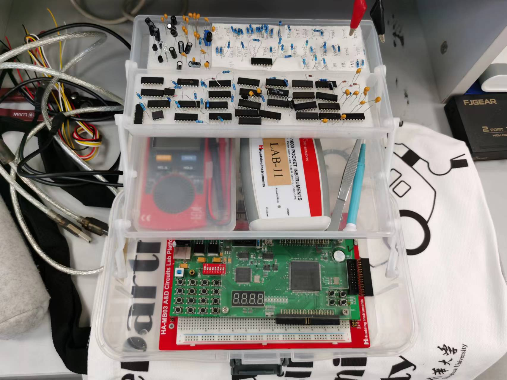

  

###**
 自动化系**
###**
 李昭阳 2021013445**

##必做一

###（1）波形图与标注

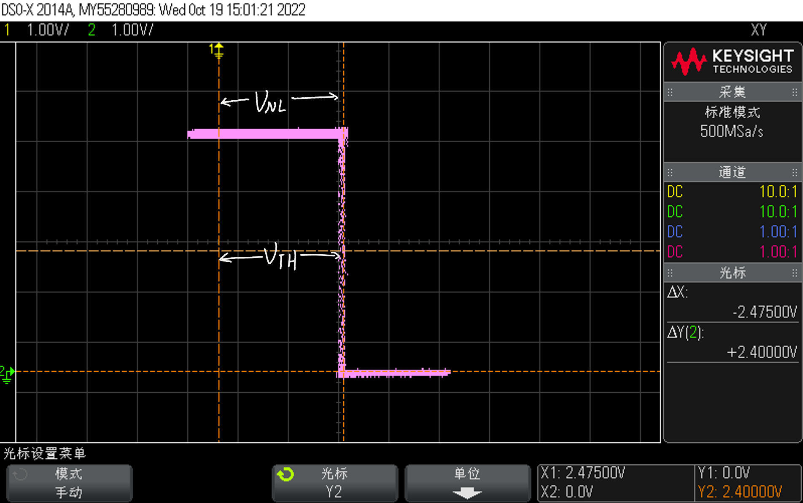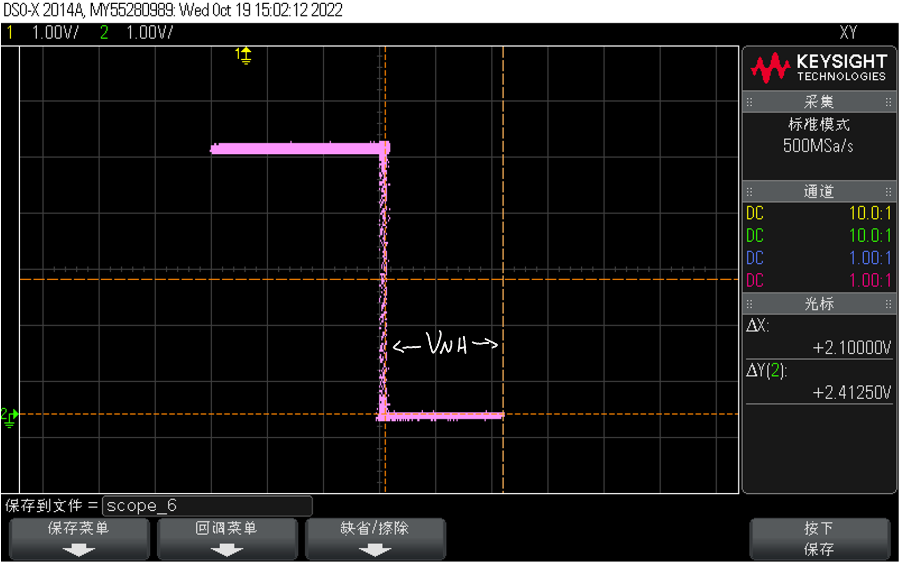

###（2）读取阈值电压以及输入噪声容限

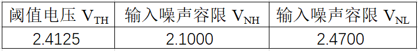

##必做二

###（1）原始数据表格

&ensp;&ensp;&ensp;
测量出VDD与VO = 4.93V之后，可以通过以下公式计算IOL，即$$I_{OL} = \frac{VDD - V_O}{R_L测}$$

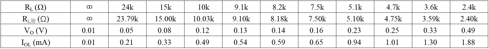

###（2）CMOS 与非门低电平输出特性曲线

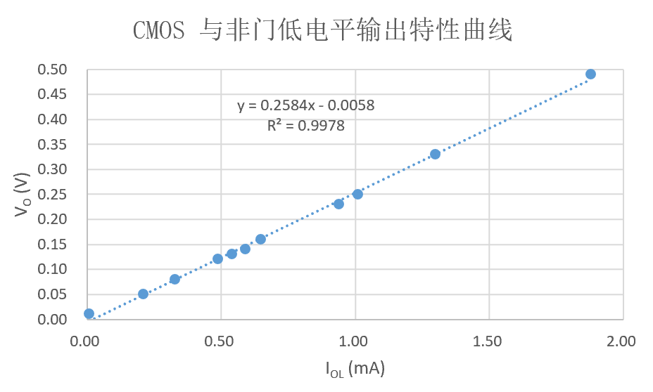

###（3）MOS 管的导通电阻 RON

&ensp;&ensp;&ensp;
拟合曲线方程为\\(y = 0.2584x - 0.0058\\)，拟合系数为0.9978，拟合效果好，可以在误差允许的范围内认为其斜率是RON，即
$$ R = \frac{V_O}{I_{OL}} = 258.4\Omega$$
##必做三

###（1）整体波形图

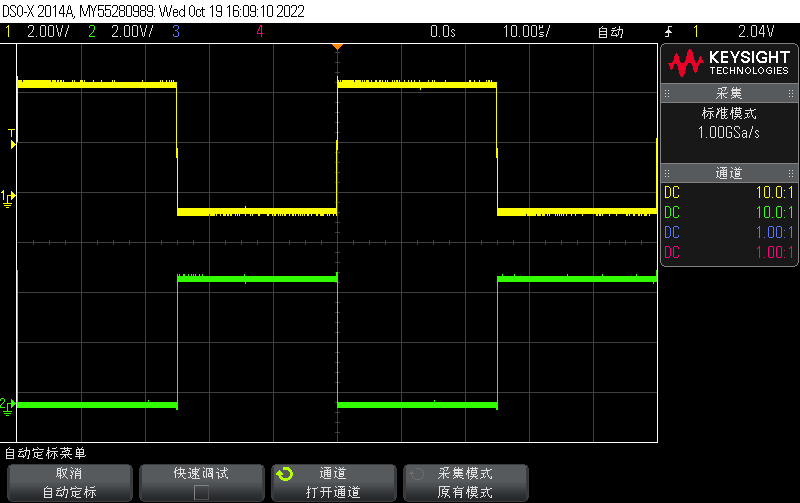
 
**黄色线是输入信号VI**
 
**绿色线是输出信号VO**

###（2）传输延迟时间波形图及标注

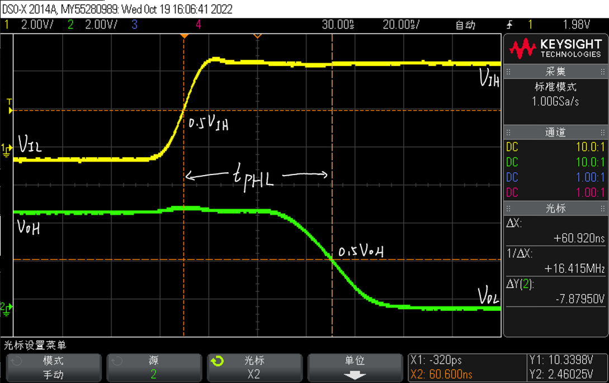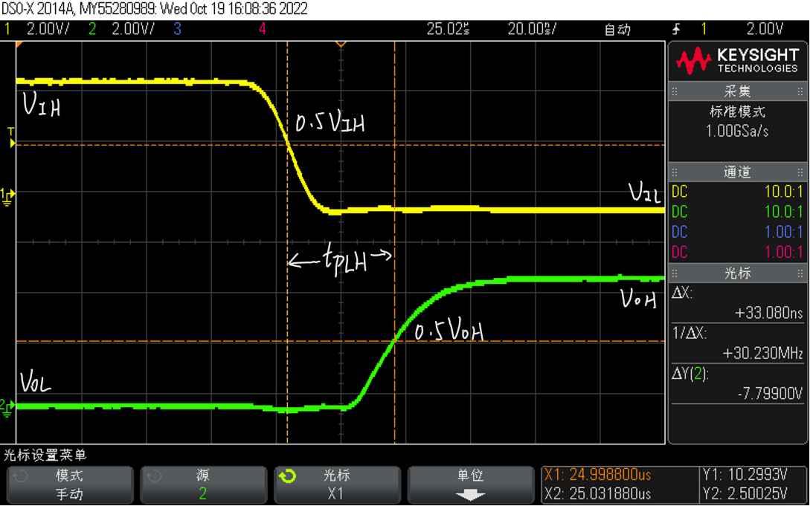
 
**左图是上升传输延迟时间数据图**
**右图是下降传输延迟时间数据图**
 
**黄色线是输入信号VI**
 
**绿色线是输出信号VO**

###（3）传输延迟时间 tPHL、tPLH的读数

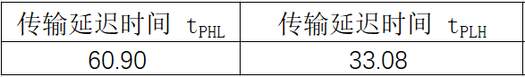

##必做四

###（1）输入、输出波形图

&ensp;&ensp;&ensp;
取样电阻R的不能太大，也不能太小。若R过小，则测得的电压值过小，与电路噪声接近，观测不准确；若R过大，则可能影响电路的逻辑功能。实验中，我选取了R = 1KΩ。

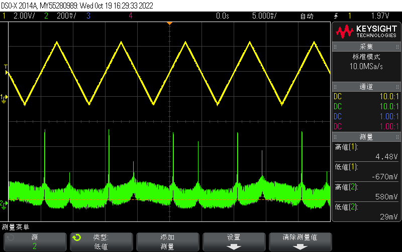
 
**黄色线是输入信号**
 
**绿色线是输出信号**

##选做一

###（1）波形图与标注

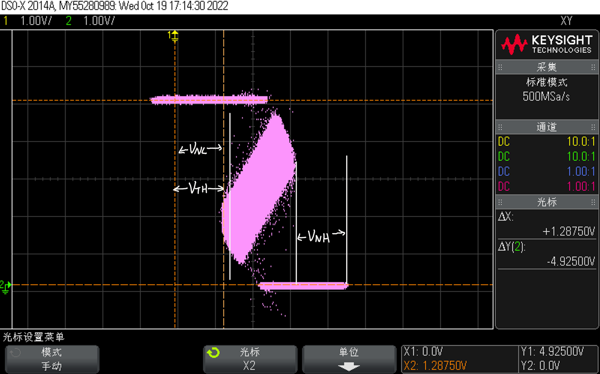

###（2）读取阈值电压以及输入噪声容限

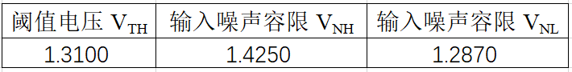

###（3）实验现象分析

&ensp;&ensp;&ensp;
CD4011在高低电平切换时，图像为一条较窄的直线，而74HC00的图像为一不规则图形。这使得74HC00的输入噪声容限比CD4011小。
 
&ensp;&ensp;&ensp;
我认为这是因为74HC00的制造工艺与CD4011不同。查阅资料显示，CMOS门电路输入端、输出端与VDD、VSS之间存在较大的寄生电感。在工作状态切换时，电感存在充放电过程，造成输入、输出电平不稳定。
 
&ensp;&ensp;&ensp;
但74HC00的传输延迟时间相较CD4011更短，达到了10ns的水平；此外，其带负载能力也提高了。因此，74HC00也有比CD4011更适合使用的情景。
##选做二

###（1）数据表格设计与实验记录

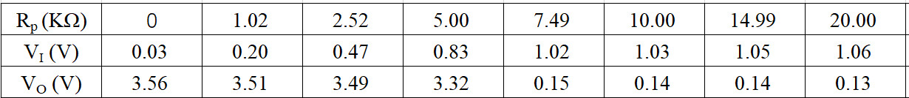

###（2）输入、输出特性数据

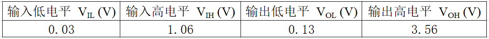

###（3）74LS00 的输入端负载特性曲线

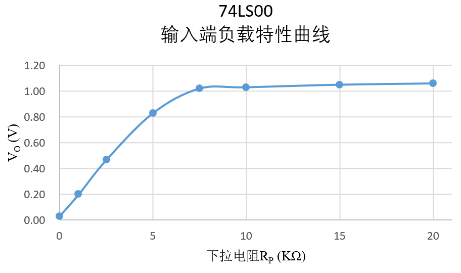

##思考题

###（1）在 CMOS 数字集成电路中，如 CD4011，若仅用其中的一个门电路，其余门电路的输入端应该如何处理？为什么？

&ensp;&ensp;&ensp;
其余门电路均应当接地，不能悬空使用。
 
&ensp;&ensp;&ensp;
若引脚悬空，其上易积累静电电压。若积累的静电电压超过了CMOS内部保护电路的设定值，则很可能击穿保护电路，甚至击穿栅极和衬底之间的绝缘层，使门电路损坏。此外，将不工作的输入端接地可以减少其对正在使用的门电路的干扰，避免产生的信号对周围的电子器件造成影响，使实验测定更准确。

###（2）在 TTL 数字集成电路中，如 74LS00，若仅用其中的一个门电路，其余门电路的输入端应该如何处理？为什么？

&ensp;&ensp;&ensp;
其余门电路的输入端可以悬空，也可以接高电平VDD，均接VDD更佳。
 
&ensp;&ensp;&ensp;
将TTL门电路输入端悬空，则由TTL的性质，相当于接入了高电平，但可能会积累静电电压导致芯片损伤。同时其产生的信号会对周围的电子器件造成影响，使得测量不准确。同时，TTL与非门中，输入低电平时输入电流比较大，输入高电平时输入电流比较小，在节能和使用寿命的方面考虑，均接VDD更佳。

###（3）如要观测 CMOS 门电路的直流噪声容限与电源电压的关系，需改变图 1 电路中芯片工作电压 VDD和测试电路输入信号 vI。请你根据实验室现有的仪器设备及其主要技术指标判断能否进行实验。如能，请写出 VDD和 vI的取值，并画出电压传输特性曲线；如不能，请写明原因。

&ensp;&ensp;&ensp;
可以进行实验。
 
&ensp;&ensp;&ensp;
以CD4011为例，其操作手册中VDD取值范围为 3V ≤ VDD ≤ 18V，故VDD取从5V到15V之间的多个值。在每一次实验中通过信号发生器输出100Hz, 0 ≤ VI ≤ VDD, 对称性为50%的锯齿波作为VI。按照图一方式连接电路，利用示波器XY时基模式观测电压传输特性曲线。最终发现直流噪声容限随着电源电压的增大而逐渐增大。
 
&ensp;&ensp;&ensp;
其电压传输特性曲线大致如下。

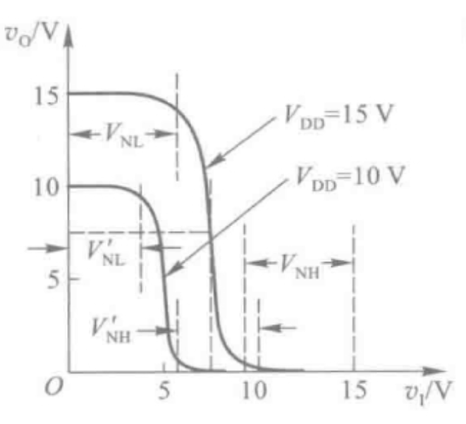

###（4）在如图 7 所示的两个电路中，不同工艺的数字集成电路在互相对接时应该满足什么条件？

&ensp;&ensp;&ensp;
前级驱动门输出高电平的最小值必须高于后级负载门输入高电平的最小值，且前级驱动门输出低电平的最大值必须低于后级负载门输入低电平的最大值。同时驱动门在输出驱动电流时应保证电流在合理范围内，防止后端MOS管被击穿或保护电路被损坏。
 
&ensp;&ensp;&ensp;
对于图a，查阅使用手册可知74LS00与非门输出高电平的最小值为2.5V，CD4011与非门输入低电平的最大容限是4.8V，产生冲突，故前端74LS00应采用OC门工艺处理。
 
&ensp;&ensp;&ensp;
对于图b，CD4011可以直接驱动后续部分74LS00，但应严格控制负载门总数n，保证在CD4011的扇出数以内。
##实验总结

###（1）实验中的测试方法以及测试中的注意事项

**常用的参数测量方法**

 
&ensp;&ensp;&ensp;
电压传输特性曲线：通道1接输入VI，通道2接输出VO，调用示波器的XY时基模式记录数据。VTH是电压传输特性转折区中点对应的输入电压。
 
&ensp;&ensp;&ensp;
低电平输出特性：改变R的值，测量输出低电平VO的值，计算出IOL，作出曲线。
 
&ensp;&ensp;&ensp;
传输延迟时间：调节示波器水平顶标，观察输入、输出波形的变化，取50%位置测量传输延迟时间。
 
&ensp;&ensp;&ensp;
动态功耗：接入取样电阻，通过电阻上的电压反应电流值。
 
&ensp;&ensp;&ensp;
输入端负载特性：改变输入端接入负载，记录所需的输入、输出电压值。
 

**注意事项**

 
&ensp;&ensp;&ensp;
测量传输延迟时间时，应当采用示波器×10档，以减小对信号产生的影响。
 
&ensp;&ensp;&ensp;
CMOS芯片其余门电路在不使用时不可以悬空。
 
&ensp;&ensp;&ensp;
实验中多次测量电阻和改接电路时应当断电，测量电阻时应当断开电阻与其他电路的连线。

###（2）在实验中遇到的问题及解决方法

&ensp;&ensp;&ensp;
在必做四中，需要确定取样电阻的大小。我对取样电阻的大小在开始没有明确的认识，选取了3KΩ，导致波形没有显著特征，应该是阻值过大已经影响了功能。之后在老师的提示下，我分析了取样电阻的适合阻值，最终选取了1KΩ。

###（3）此次实验的收获

&ensp;&ensp;&ensp;
通过这次实验，我通过对门电路的特性进行了探究，对数字电路有了形象化的认识。实验进行得较为顺利，并较快地完成了全部的实验任务。大致有以下几点收获。
 
&ensp;&ensp;&ensp;
提高了查阅数据手册的能力，对于陌生芯片的认识能力得到了增强。
 
&ensp;&ensp;&ensp;
了解了数字电路中门电路各类数据的正确测量方法。
 
&ensp;&ensp;&ensp;
在实验中锻炼了细节处理能力。例如，在测量阻值时，应断开电源与电路连接；在利用示波器测量电压时，可以恰当利用示波器的自动测量模式，但对于个别难以自动监测的值也需要手动测量。
 
&ensp;&ensp;&ensp;
提高了对数字电子技术课程中学习的各种知识的形象化认识，有助于后续的学习。

