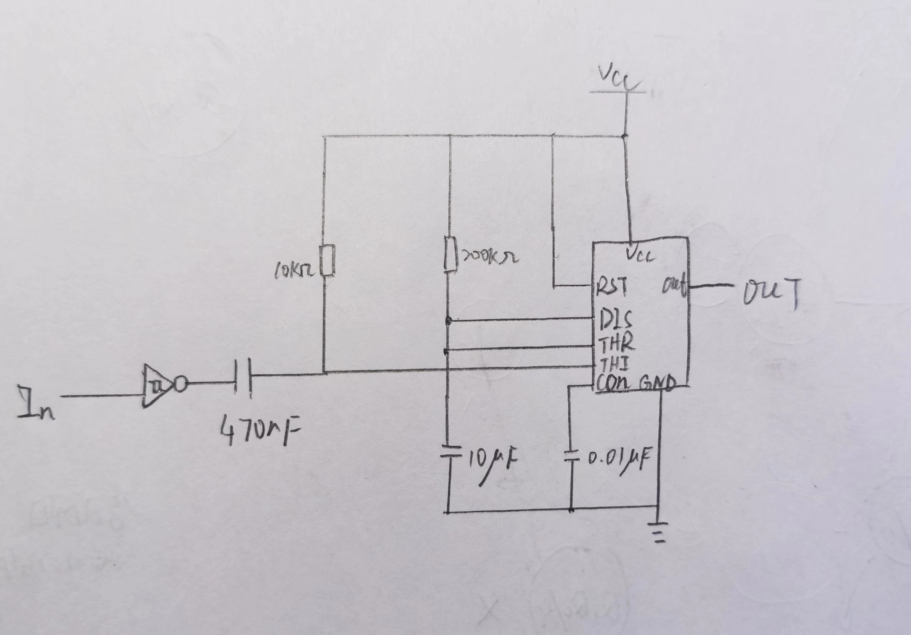
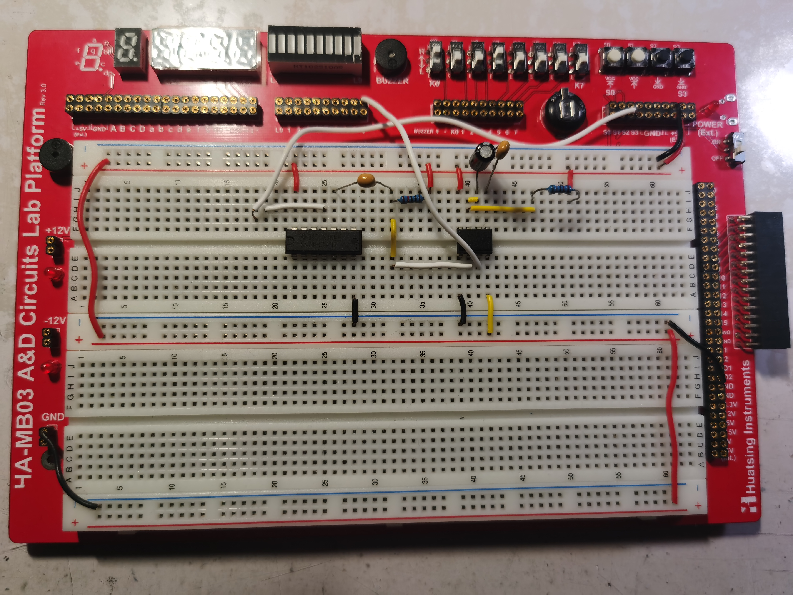

  

#
<big>脉冲波形发生电路的设计实验报告
   

  

###**
 自动化系**
###**
 李昭阳 2021013445**

##必做任务 + 选做任务

###（1）电路图

###（2）模块分析

&ensp;&ensp;&ensp;
微分模块的功能是从输入端取一个窄脉冲，并输出一个相对宽的脉冲。当输入低电平时，由于电容两段的电压不能突变，微分电路的输出也为低电平，此时电容会充电，并在一段时间后回到高电平。由此产生的负脉冲可作为单稳态电路的触发信号。微分电路使定时电路的输入不受输入脉冲宽度的影响，若持续遮挡红外对管，LED灯在一段时间后仍能熄灭。微分模块取R = 100kΩ，C = 470nF，τ = RC = 4.7ms，能够满足要求。
 
&ensp;&ensp;&ensp;
定时模块由555定时器接成的单稳态电路构成，R = 200kΩ， C = 10μF，τ = RCln3 = 2.19s。

###（3）整体电路图

&ensp;&ensp;&ensp;
设计电路图如下，

##思考题

###R1 的选取应考虑哪些因素？这次实验中 D1 导通的正向电流是多少、导通压降是多少？

&ensp;&ensp;&ensp;
R1过小可能导致流过红外发射管的电流过大，使得发射管损坏；R1过大可能使电流不足以使发射管发射红外光。本次实验取R1 = 1kΩ时，D1的正向导通电流为3.85mA；导通压降为1.087V

###请简述 R2 选取原则。在实验中使用的是 74HC 系列器件，若将其更换为 74LS 系列器件 R2 取值会发生什么变化？

&ensp;&ensp;&ensp;
R2应当满足，当光电三极管导通时，可以输出合理范围的低电平；当其截止时，可以使得上拉的高电平合理输出。
 
&ensp;&ensp;&ensp;
更换为74LS器件后，TTL电路会有不可忽略的漏电流造成的压降。分析可知，R2的最小值会增大，最大值会减小，即R2的取值范围缩小。
##实验总结

###（1）脉冲波形发生电路的设计和调试步骤

&ensp;&ensp;&ensp;
(1)分模块设计，根据各模块信号间关系画出原理图;
 
&ensp;&ensp;&ensp;
(2)根据要求计算出合理的R、C值;
 
&ensp;&ensp;&ensp;
(3)搭接电路并用波形观察是否符合输出要求；
 
&ensp;&ensp;&ensp;
(4)调试时应当充分注意电容等器件，可以用示波器观察其波形，分析不符合预期的输入输出，并进行进一步调试；
 
&ensp;&ensp;&ensp;
(5)排出故障后再次搭接电路并调试。

###（2）在实验中遇到的问题及解决方法

&ensp;&ensp;&ensp;
在实验时，我的红外发射管疑似出现故障，先用按钮进行了初步模拟，后来再经过排除故障，发现是红外发射管和光电三极管未能正直相对造成。在排除故障之后，可以正常实现电路要求。

###（3）此次实验的收获

&ensp;&ensp;&ensp;
•脉冲波形发生电路进行了实践，引发了对单稳态电路的思考。
 
&ensp;&ensp;&ensp;
•进一步熟练了利用面包板搭接电路的方法，获得了一些调试、解决故障的思路。
 
&ensp;&ensp;&ensp;
•电路延时操作有了进一步的理解。

