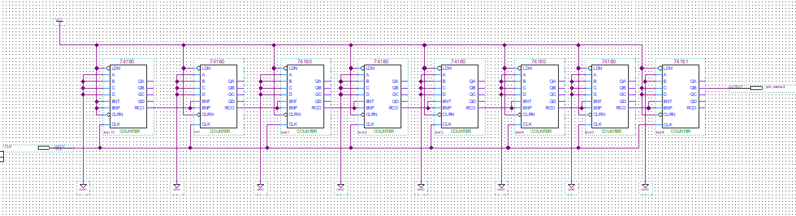

  

#
<big>时序逻辑电路的设计实验报告
   

  

###**
 自动化系**
###**
 李昭阳 2021013445**

##必做任务

###（1）星期显示电路

&ensp;&ensp;&ensp;
画出状态转换图，

&ensp;&ensp;&ensp;
由状态转换图得出状态方程，
$$Q_0^* = Q_0' ⊕ (Q_0Q_1Q_2)$$
$$Q_1^* = Q_0 ⊕ Q_1$$
$$Q_2^* = (Q_0Q_1) ⊕ Q_2$$
&ensp;&ensp;&ensp;
由状态转换图得出输出方程，
$$Y_0 = Q_0 ⊕ (Q_0Q_1Q_2)$$
$$Y_1 = Q_1 ⊕ (Q_0Q_1Q_2)$$
$$Y_2 = Q_2 ⊕ (Q_0Q_1Q_2)$$
$$Y_3 = Q_0Q_1Q_2$$
&ensp;&ensp;&ensp;
由D触发器特性方程 \\(D = Q^*\\) 得出驱动方程，
$$D_0 = Q_0' ⊕ (Q_0Q_1Q_2)$$
$$D_1 = Q_0 ⊕ Q_1$$
$$D_2 = (Q_0Q_1) ⊕ Q_2$$
&ensp;&ensp;&ensp;
画出电路图，

&ensp;&ensp;&ensp;
选取芯片搭建面包板如下，

###（2）时钟信号发生电路

&ensp;&ensp;&ensp;
查阅FPGA板参数可知，板载晶振的固有频率 \\(f_M = 50 MHz\\)，应当设计一个分频电路使得频率降至 \\(1 - 5 Hz\\) 之间。故首先应当通过 7 个 \\(74HC160\\) 的极联，使得 \\(f = \frac{f_M}{7 \times 10} = 5 Hz\\)；再设计一个分频器对 \\(5 Hz\\)的信号继续分频，对于 \\(74HC161\\) 而言，每四次CLK的上升沿到达，\\(Q_1\\) 由0变1再变0，即 \\(T_{Q_1} = 4T\\)，则分频后电路 \\(f_0 = \frac{f}{4} = \frac{5}{4} = 1.25 Hz\\)，同时由于在\\(Q_1\\)一个周期内高电平和低电平出现的时间相当，故占空比约为50%。
 
&ensp;&ensp;&ensp;
设计电路图如下，

##思考题

###加计数

&ensp;&ensp;&ensp;
初始状态\\(Q_3Q_2Q_1Q_0 = 0000\\)，当状态转换为\\(Q_3Q_2Q_1Q_0 = 1100\\)时输出一个置位信号，并在下一个CLK上升沿到来时将电路状态置为\\(Q_3Q_2Q_1Q_0 = 0000\\)。
 
&ensp;&ensp;&ensp;
设计电路图如下，

###减计数

&ensp;&ensp;&ensp;
初始状态\\(Q_3Q_2Q_1Q_0 = 1100\\)，当状态转换为\\(Q_3Q_2Q_1Q_0 = 0000\\)时输出一个置位信号，并在下一个CLK上升沿到来时将电路状态置为\\(Q_3Q_2Q_1Q_0 = 1100\\)。
 
&ensp;&ensp;&ensp;
设计电路图如下，

##实验总结

###（1）时序逻辑电路的设计和调试步骤

&ensp;&ensp;&ensp;
(1)通过时序逻辑的分析方法，得到正确的状态转换图;
 
&ensp;&ensp;&ensp;
(2)通过状态转换图列出每一个变量的卡诺图并进行化简;
 
&ensp;&ensp;&ensp;
(3)通过每个变量的卡诺图，写出电路的状态方程和输出方程；
 
&ensp;&ensp;&ensp;
(4)带入对应触发器的特性方程，解出电路的驱动方程；
 
&ensp;&ensp;&ensp;
(5)搭接电路并调试。调试时可以用拨码开关模拟时钟信号输入，用万用表测量每一个电路节点的电压状态，观察是否符合预期；也可以使用模块化的方法调试。

###（2）在实验中遇到的问题及解决方法

&ensp;&ensp;&ensp;
在实验搭建电路时，我的面包板本身存在故障，导致必须要用力按压某个芯片部位才可以正常工作。对此我尝试了多种方法，但仍旧未能解决面包板的故障，最终决定今后设计电路时避开故障部位，并在必要时联系老师更换面包板。

###（3）此次实验的收获

&ensp;&ensp;&ensp;
•对时序逻辑电路搭建进行了实践，引发了对电路状态的思考。
 
&ensp;&ensp;&ensp;
•进一步熟练了利用面包板搭接电路的方法，获得了一些调试、解决故障的思路。
 
&ensp;&ensp;&ensp;
•对分频电路进一步加深了解，同时对分频占空比有了一定的思考。

